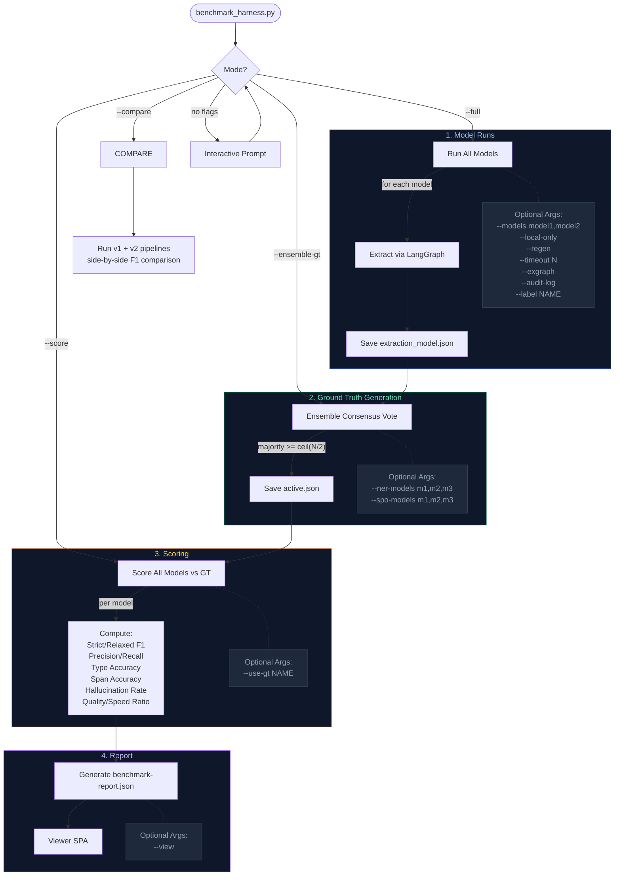

# Extraction Benchmark Reference

Definitive reference for the NER + SPO extraction benchmark system.

## Overview

The benchmark measures extraction quality (Named Entity Recognition and Subject-Predicate-Object propositions) across 15 models ranging from 300M-parameter encoders to cloud LLMs. It answers: "which model produces the best extractions from our pipeline, and at what cost?"

### 4-Phase Flow

1. **Model runs** -- extract mentions and propositions from benchmark chunks using each model
2. **Ensemble ground truth** -- generate consensus GT via majority voting across model panels
3. **Scoring** -- compute F1/precision/recall for each model against GT (leave-one-out)
4. **Report** -- build `benchmark-report.json` for the viewer SPA

Single CLI entry point: `tests/benchmark_harness.py`

## Quick Start

```bash
task bench                    # full methodology (run + GT + score + report)
task bench -- --local-only    # skip cloud models (no API key needed)
task bench:view               # viewer SPA at http://localhost:5173/viewer/benchmarks
```

## Architecture

### Benchmark Flow



### Shared Code Path

The benchmark harness, integration test, and Dagster production assets all share the same extraction function:

```
Harness        --> subprocess --> pytest test_pipeline_integration.py --> extract_validated()
Integration    --> pytest test_pipeline_integration.py               --> extract_validated()
Dagster asset  --> asset_factory                                     --> extract_validated()

Same code path: LangGraph (chunk --> NER --> validate --> repair --> SPO)
```

Cached artifacts are interchangeable -- an extraction generated by the harness can be consumed by the integration test and vice versa. This ensures benchmarks measure the real pipeline, not a test-only approximation.

## Model Registry

All models are defined in `tests/benchmark_config.py`.

| Name | Model ID | Params | Category | Context | Structured Method |
|------|----------|--------|----------|---------|-------------------|
| gliner-medium | gliner | 300M | encoder | 512 | in-process |
| gliner-large | gliner-large | 600M | encoder | 512 | in-process |
| gliner-pii | gliner-pii | 300M | encoder | 512 | in-process |
| nuextract-2.0-8b | nuextract2:latest | 8B | encoder | 4096 | json_mode |
| nuextract-1.5 | nuextract1.5:latest | 3.8B | extraction-specialist | 4096 | json_mode |
| universalner-7b | universalner:latest | 7B | extraction-specialist | 4096 | json_mode |
| gemma3-12b | gemma3:12b | 12B | tier1 | 8192 | json_mode |
| mistral-7b | mistral:latest | 7B | tier2 | 8192 | json_mode |
| qwen2.5-7b | qwen2.5:7b-instruct | 7B | tier2 | 8192 | json_mode |
| llama3.1-8b | llama3.1:8b | 8B | tier2 | 8192 | json_mode |
| llama3.2-3b | llama3.2:latest | 3B | tier2 | 4096 | json_mode |
| gemma3-4b | gemma3:4b | 4B | tier2 | 8192 | json_mode |
| gpt-4o-mini | gpt-4o-mini | -- | cloud | 128K | function_calling |
| gpt-4o | gpt-4o | -- | cloud | 128K | function_calling |
| claude-sonnet-4 | claude-sonnet-4-20250514 | -- | cloud | 200K | function_calling |

**Categories:**
- **encoder** -- non-LLM models, run in-process (GLiNER) or via Ollama (NuExtract 2.0)
- **extraction-specialist** -- purpose-built for NER (NuExtract, UniversalNER)
- **tier1** -- best LLMStructBench composite scores (arxiv:2602.14743)
- **tier2** -- strong empirical performers in our extraction pipeline
- **cloud** -- cloud API models via LiteLLM proxy (require `LLM_API_KEY`)

**Structured output methods:**
- `function_calling` -- OpenAI tool/function calling (default for cloud)
- `json_mode` -- forces JSON output via `response_format` (default for local)
- `json_schema` -- OpenAI strict JSON schema mode
- `in-process` -- GLiNER runs directly in Python, no serving endpoint

## Ground Truth

### Ensemble Consensus Voting

The recommended approach. Multiple models vote on each entity/proposition:

1. Load extraction artifacts for each model in the NER/SPO panels
2. For each chunk, collect all mentions/propositions from all models
3. A mention is accepted if `>= ceil(N/2)` models agree on `(normalized_text, type)`
4. A proposition is accepted if `>= ceil(N/2)` models agree on `(subject, predicate, object)`
5. Spans are recomputed deterministically against source text
6. Confidence = fraction of models that agreed

**Leave-one-out scoring**: when scoring model M, the ensemble GT is recomputed excluding M. This eliminates tautological bias where a model's own output inflates its score.

**Default panels** (in `benchmark_config.py`):
- NER: gliner-large, gpt-4o, claude-sonnet-4, mistral:latest, gemma3:12b
- SPO: claude-sonnet-4, gpt-4o

### Custom Thresholds

```bash
# Override the ensemble model panels:
python tests/benchmark_harness.py --ensemble-gt \
    --ner-models "gliner-large,gpt-4o,mistral:latest" \
    --spo-models "gpt-4o,mistral:latest"
```

### GT Management

```bash
python tests/benchmark_harness.py --list-gt            # list available GTs
python tests/benchmark_harness.py --use-gt ensemble-5model  # switch active GT
python tests/benchmark_harness.py --ensemble-gt        # regenerate ensemble GT
python tests/benchmark_harness.py --generate-gt --gt-model gpt-4o  # single-model GT
```

### Human Review Workflow

1. Generate ensemble GT: `--ensemble-gt`
2. Open the viewer SPA (`task bench:view`) and go to the **Ground Truth** tab
3. Review and correct entities: fix wrong types, span offsets, missing entities, false positives
4. Save -- the GT editor sets `"manually_reviewed": true`
5. Manually-reviewed GT is protected from overwrite by `--ensemble-gt`

Validate spans: `pytest tests/test_extraction_benchmark.py -k "self_check" -v -s`

## Scoring Methodology

### Extraction Quality (requires ground truth)

| Metric | Description |
|--------|-------------|
| **Strict F1** | text + mention_type both match (normalized). Harmonic mean of precision and recall. |
| **Relaxed F1** | text matches, type may differ |
| **Precision** | of predictions, how many were correct? |
| **Recall** | of actual entities, how many did the model catch? |
| **Type Accuracy** | among text-matched entities, fraction with correct entity type |
| **Span Accuracy** | fraction where `source_text[start:end] == entity_text` |
| **Hallucination Rate** | `1 - span_accuracy` (see Known Limitations) |

Both strict and relaxed variants are computed for mentions and propositions.

**Mention matching**: strict requires `(normalized_text, type)` match; relaxed requires only `normalized_text`.

**Proposition matching**: strict requires `(subject, predicate, object)` all match; relaxed requires only `(subject, object)`.

**F1 formula**: `F1 = 2 * (precision * recall) / (precision + recall)`. The harmonic mean punishes imbalance -- 99% precision + 1% recall = ~2% F1, not 50%.

### Efficiency Metrics (no ground truth needed)

| Metric | Description |
|--------|-------------|
| **Tokens/sec** | Generation throughput |
| **Per-chunk latency** | `duration / chunk_count` |
| **Quality/Speed Ratio** | `F1 / duration` (see Known Limitations) |

### Provenance Completeness (no ground truth needed)

| Field | Description |
|-------|-------------|
| **overall** | Average of all field coverage rates (0-1) |
| **has_provenance** | Fraction of mentions/assertions with a Provenance object |
| **has_span** | Fraction with valid span_start/span_end positions |
| **has_extraction_model** | Fraction recording which LLM produced the extraction |
| **has_code_location** | Fraction recording which Dagster pipeline ran it |
| **assertion_linked_subject** | Fraction of assertions where subject links to a Mention ID |
| **assertion_linked_object** | Fraction of assertions where object links to a Mention ID |

### Pipeline Metrics (from MCP validation audit trail)

- Per-stage call counts (extract, validate, repair)
- Validation verdicts (valid/ambiguous/invalid)
- Repair cycle counts
- MCP error codes (SPAN_MISMATCH, DUPLICATE_SPAN, etc.)

## Viewer UI

Start: `task bench:view` or `cd packages/media-ingest/viewer-ui && npm run dev`

URL: `http://localhost:5173/viewer/benchmarks`

### Tabs

| Tab | Contents |
|-----|----------|
| **Overview** | Stat cards, performance bar charts, model cards grouped by type |
| **Scores** | F1 comparison charts, precision/recall table, efficiency metrics, GT selector |
| **Entities** | Matrix showing which models found which entities |
| **Propositions** | SPO triple matrix across models |
| **Pipeline** | LangGraph stage breakdown with MCP validation stats |
| **Audit** | Gantt chart of extraction pipeline per model (select any two for comparison) |
| **Ground Truth** | GT editor for human review, shared GT selector with Scores tab |

### Controls

- **Group by**: type, tier, size, runtime
- **Model filter**: select/deselect individual models
- **GT selector**: shared between Scores and Ground Truth tabs -- switch between GT versions
- **Report source**: Latest, Latest Run, v1, v2

## CLI Reference

### Action Flags

| Flag | Description |
|------|-------------|
| `--full` | Full methodology: run models -> ensemble GT -> score -> report |
| `--run` | Run models (default when no action flag) |
| `--ensemble-gt` | Generate ground truth via multi-model consensus |
| `--generate-gt` | Generate ground truth from a single model |
| `--compare` | Compare v1 vs v2 pipelines side-by-side |
| `--score` | Re-score latest run against active GT (no model runs) |
| `--report` | Rebuild report JSON from latest run (no model runs) |
| `--list-gt` | List available ground truth files |
| `--use-gt NAME` | Set active ground truth by name |
| `--list-runs` | List timestamped benchmark runs |
| `--clean` | Clean cached artifacts (keep true fixtures) |
| `--view` | Start the benchmark viewer SPA |

### Configuration Flags

| Flag | Description |
|------|-------------|
| `--regen` | Clear and regenerate all extraction artifacts |
| `--audit-log` | Save structured audit logs per model |
| `--timeout N` | Per-model timeout in seconds (default: 300) |
| `--local-only` | Skip cloud models (no API key needed) |
| `--exgraph` | Use exgraph v2 pipeline |
| `--label NAME` | Label for this run (used in runs/ dir name) |
| `--models LIST` | Run only specific models (comma-separated) |
| `--ner-models LIST` | Override ensemble NER panel (comma-separated) |
| `--spo-models LIST` | Override ensemble SPO panel (comma-separated) |
| `--gt-model MODEL` | Model for single-model GT generation (default: gpt-4o) |
| `--chunk-size TOKENS` | Override chunk size in tokens for A/B testing |

## Task Commands

| Task | Description |
|------|-------------|
| `task bench` | Full benchmark methodology |
| `task bench:run` | Run extraction benchmarks (skip GT regen) |
| `task bench:ground-truth` | Generate ensemble ground truth only |
| `task bench:report` | Regenerate report with F1 scores |
| `task bench:view` | Start benchmark viewer SPA |
| `task bench:clean` | Standard: extractions + GT + runs + reports |
| `task bench:clean:extractions` | Just extraction artifacts |
| `task bench:clean:runs` | Just timestamped runs (keep pipeline cache) |
| `task bench:clean:pipeline` | Pipeline cache (transcription, diarization) -- EXPENSIVE |
| `task bench:clean:all` | Nuclear: everything except true fixtures |

## Artifact Management

### True Fixtures (checked into git, never cleaned)

```
tests/fixtures/
    media-ingest/
        benchmark_chunks.json    # curated audio chunks (3 chunks)
    congress-data/
        benchmark_chunks.json    # curated bill chunks (4 chunks)
    open-leaks/
        benchmark_chunks.json    # curated leak chunks (3 chunks)
    benchmark_chunks.json        # legacy single-file fallback
    demo_video.mp4               # source media for pipeline integration tests
    model_cache/                 # local model weights cache
```

`BenchmarkStore.load_benchmark_chunks()` merges chunks from all three
per-domain dirs. Each domain can scale its fixture set independently.

### Cached Artifacts (generated, gitignored, regenerable)

```
.test-output/media-ingest/
    pipeline-cache/              # slow audio-model outputs only
        0_transcription.json     # Whisper output (slow, cached; stage prefix = order)
        1_diarization.json       # pyannote output (slow, cached)
                                 # segment_merge + chunking are fast — recomputed
                                 # from cached transcription+diarization on every run.
    ground-truth/                # ground truth versions
        ensemble-12model.json    # named, versioned
        active.json              # currently used for scoring
    extractions/                 # cross-run cached LLM extractions
        extraction_<model>.json
    runs/                        # timestamped benchmark runs
        2026-04-29-exgraph-v2/
            extractions/         # extraction_<model>.json per model
            audit-logs/          # structured audit logs per model
            benchmark-report.json
            run-config.json
        latest -> ...            # symlink to most recent run
    benchmark-report.json        # top-level copy for viewer SPA
    audit-logs/                  # top-level copy for viewer SPA
```

The two-stage cache (transcription + diarization only) is intentional. Both
are slow audio-model outputs (~5–60s each on Metal, minutes on CPU). The
`segment_merge` and `chunks` stages are pure-Python passes that take
milliseconds, so caching them adds disk noise without saving time.

### Tiered Clean System

| Tier | Command | What it removes | Regen cost |
|------|---------|-----------------|------------|
| Quick | `bench:clean:extractions` | extraction_*.json only | Low (re-run models) |
| Standard | `bench:clean` | extractions + GT + runs + reports | Medium |
| Runs-only | `bench:clean:runs` | timestamped runs (keeps pipeline cache + GT) | Medium |
| Pipeline | `bench:clean:pipeline` | transcription, diarization, chunking | **High** (Whisper + pyannote) |
| Nuclear | `bench:clean:all` | everything except `tests/fixtures/` | **Very high** |

### Cache Dependency Chain

```
demo_video.mp4 (true fixture)
  --> 0_transcription.json (cached — Whisper)
        backend = WHISPER_BACKEND env (mlx-whisper / openvino / faster-whisper)
        ~13s on M3 Metal (mlx-base) | ~30-60s CPU (faster-whisper base)
    --> 1_diarization.json (cached — pyannote, needs HF_TOKEN)
          device auto-selects: cuda → mps → cpu
          ~25s on M3 MPS | ~60-120s CPU
      --> [recomputed] segment_merge (fast Python pass)
        --> [recomputed] chunks via ChunkingResource.chunk_speaker_segments (fast)
          --> extraction_{model}.json (per model, seconds to minutes)
            --> ground_truth (ensemble from multiple extractions)
              --> benchmark-report.json (scoring, fast)
```

### Pre-warming the audio cache

The benchmark harness's `_run_model` invokes pytest as a subprocess with
`capture_output=True`. The first model's subprocess pays the cold
transcription/diarization cost — but you can't see Whisper progress because
stdout is captured. Run the prewarmup task first to see live progress and
populate the cache:

```bash
WHISPER_BACKEND=mlx-whisper task bench:pipeline:warm   # Apple Silicon
task bench:pipeline:warm                                # other platforms
```

The fixtures print a `[prewarmup] AUDIO PIPELINE — STAGE 1/2: TRANSCRIPTION`
banner, the resolved backend/device, and elapsed time per stage. After
prewarmup, every model in `task bench` reuses the cached audio output and
runs in seconds instead of minutes.

Delete any file to force regeneration from that stage onward. Pipeline cache (Steps 1-4) is model-independent -- only extraction varies per model.

## Configuration

### BenchmarkConfig

Unified, serializable config saved to `run-config.json` in each run directory.

```python
@dataclass
class BenchmarkConfig:
    chunk_config: ChunkConfig       # target_tokens, target_chars, strategy
    models: list[ModelConfig]       # which models to run
    ner_ensemble: list[str]         # NER consensus panel
    spo_ensemble: list[str]         # SPO consensus panel
    ensemble_threshold: str         # "majority"
    exgraph_enabled: bool           # v2 pipeline
    timeout_s: int                  # per-model timeout
    audit_log: bool                 # save audit traces
    label: str                      # run label
```

### Environment Variables

| Variable | Required For | Default |
|----------|-------------|---------|
| `LLM_API_KEY` | Cloud model extraction | -- |
| `OPENAI_API_KEY` | Cloud model extraction (alias) | -- |
| `LLM_MODEL` | Model selection | `gpt-4o-mini` |
| `LLM_BASE_URL` | Custom endpoint (vLLM, Ollama) | OpenAI |
| `HF_TOKEN` | Pyannote diarization models | -- |
| `EXGRAPH_ENABLED` | Enable exgraph v2 pipeline | `false` |
| `TEST_OUTPUT_ROOT` | Override test output location | `.test-output` |
| `PROMPT_REGISTRY_DIR` | Prompt file directory | `k8s/shared/prompts/` |

### Prompt Files

Located at `k8s/shared/prompts/`:
- `mention_extraction.prompt` -- NER extraction prompt
- `mention_repair.prompt` -- NER validation/repair prompt
- `proposition_extraction.prompt` -- SPO extraction prompt
- `proposition_repair.prompt` -- SPO validation/repair prompt

## Provenance Tracking

Each extraction carries provenance metadata linking every mention and assertion back to its source.

### Tracked Fields

| Field | Description |
|-------|-------------|
| `source_document_id` | Which document was processed |
| `chunk_id` | Which chunk within the document |
| `span_start` / `span_end` | Character offsets into the chunk text |
| `extraction_model` | Which LLM produced the extraction |
| `code_location` | Which Dagster pipeline ran it |
| `speaker` | Speaker label from diarization |
| `temporal` | Temporal context (if available) |

### Assertion-Mention Linkage

Assertions (SPO triples) link back to mentions via `subject_mention_id` and `object_mention_id`. This creates a complete provenance chain: document -> chunk -> span -> mention -> assertion.

### Serialization Roundtrip

All extraction output is JSON-serializable. The `BenchmarkStore` handles save/load with consistent schema. Extraction fixtures from the harness, integration tests, and Dagster assets are interchangeable.

## Adding New Models

1. Add a `ModelConfig` entry to `tests/benchmark_config.py`:
   ```python
   ModelConfig(
       name="your-model",
       model="your-model:tag",
       base_url=OLLAMA_BASE,       # or LITELLM_BASE for cloud
       context_window=8192,
       tags=["ollama", "7b", "tier2"],
   )
   ```
   Add it to the appropriate list (`TIER2_MODELS`, `CLOUD_MODELS`, etc.).

2. Run the model:
   ```bash
   python tests/benchmark_harness.py --models your-model
   ```

3. Score against GT:
   ```bash
   python tests/benchmark_harness.py --score
   ```

4. Compare in the viewer:
   ```bash
   task bench:view
   ```

## Known Limitations

- **Hallucination rate is misnamed**: it measures `1 - span_accuracy` (whether `source_text[start:end]` matches the entity text). This detects span alignment errors, NOT entity fabrication. A model could hallucinate an entity that happens to appear in the source text and get 100% span accuracy.

- **Quality/speed ratio is dimensionally incoherent**: computed as `F1 / duration_seconds`. F1 is unitless (0-1), duration is seconds, so the ratio has units of 1/seconds. It is useful only for relative ranking within a single benchmark run, not as an absolute metric.

- **SPO ground truth is sparse**: only 2 models in the default SPO ensemble panel (claude-sonnet-4, gpt-4o). This means the consensus threshold is effectively unanimity. Adding more SPO-capable models to the panel would improve GT quality.

- **Ensemble consensus excludes rare-but-correct entities**: if only one model correctly identifies an entity, it gets excluded from GT because it fails the majority vote. This systematically penalizes models that find entities others miss. The leave-one-out scoring partially mitigates this but doesn't fully solve it.

- **Cloud models require LiteLLM proxy**: cloud models route through `http://litellm.talos00/v1` by default. Override with `LLM_BASE_URL` env var if your proxy is elsewhere.

## Related Docs

- [TESTING.md](TESTING.md) -- integration test pipeline, congress/open-leaks cascades
- [Architecture Diagrams](docs/architecture/pipeline-lineage.md) -- Dagster SDA + LangGraph topology
