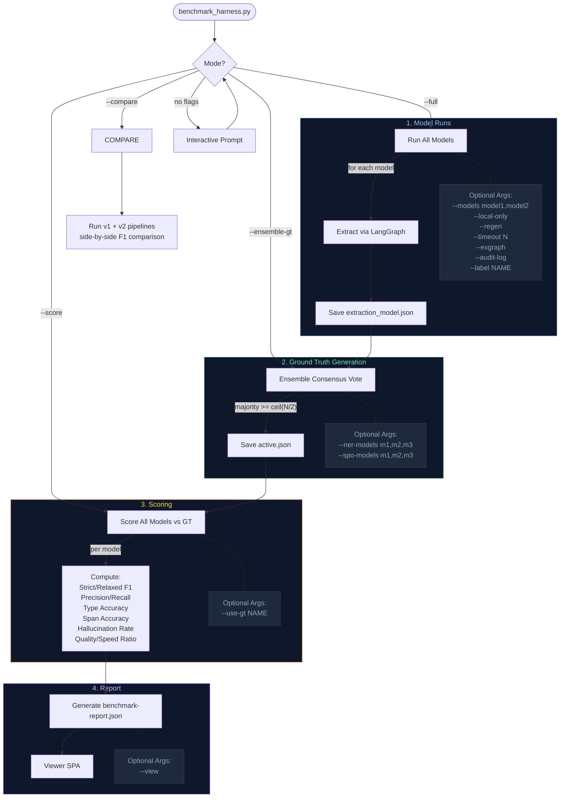

# Testing Guide

This project uses pytest with a cascading fixture pattern. Integration tests run actual pipeline code against real data sources and save output at each stage for downstream tests to consume.

## Quick Start

```bash
# Full benchmark (run all models, generate ground truth, score, report):
PYTHONPATH=. python tests/benchmark_harness.py --full --exgraph

# Interactive mode (guided menu):
PYTHONPATH=. python tests/benchmark_harness.py

# Unit tests (fast, no API keys needed):
pytest libs/ packages/ -k "not integration and not llm and not slow"
```

## Quick Reference

```bash
# Media-ingest integration (requires demo_video.mp4)
pytest tests/test_pipeline_integration.py -v -s

# Media-ingest extraction (requires LLM API key)
LLM_MODEL=gpt-4o-mini OPENAI_API_KEY=xxx \
    pytest tests/test_pipeline_integration.py -k "extraction" -v -s

# Congress integration (requires Congress API key)
CONGRESS_API_KEY=xxx DAGSTER_CODE_LOCATION=congress_data \
    pytest packages/congress-data/tests/integration/ -v -s

# Congress extraction (requires both API keys)
CONGRESS_API_KEY=xxx LLM_API_KEY=xxx LLM_MODEL=gpt-4o-mini DAGSTER_CODE_LOCATION=congress_data \
    pytest packages/congress-data/tests/integration/test_pipeline.py -k "gold or full" -v -s
```

## Directory Structure

There are two distinct categories of test data:

**True Fixtures** (checked into git, never deleted by `--regen` or `bench:clean`):
```
tests/fixtures/
    benchmark_chunks.json    # curated benchmark subset (4 representative chunks)
    demo_video.mp4           # source media for pipeline integration tests
    model_cache/             # local model weights cache
```

**Cached Artifacts** (generated, gitignored, regenerable):
```
.test-output/media-ingest/
    pipeline-cache/              # expensive pipeline outputs cached between runs
        transcription.json       # Step 1: Whisper transcription
        diarization.json         # Step 2: Speaker diarization
        segment_merge.json       # Step 3: Same-speaker merge
        chunks.json              # Step 4: Speaker-aware chunking
        benchmark_chunks.json    # copy of curated subset
    ground-truth/                # ground truth versions (independent of runs)
        ensemble-5model.json     # named, versioned
        active.json              # currently used for scoring
    runs/                        # timestamped benchmark runs
        2026-04-29-exgraph-v2/
            extractions/         # extraction_model.json per model
            audit-logs/          # structured audit logs per model
            benchmark-report.json
            run-config.json
        latest -> ...            # symlink to most recent run
    fixtures/                    # legacy flat layout (backward compat)
        extraction_*.json        # LLM extraction outputs per model
        ground_truth_*.json      # ground truth (synced with ground-truth/)
    benchmark-report.json        # top-level copy for viewer SPA
    audit-logs/                  # top-level copy for viewer SPA
```

## Test Structure

```
tests/
    conftest.py                     # shared Dagster fixtures, safe env defaults
    test_pipeline_integration.py    # media-ingest: full pipeline cascade
    test_extraction_benchmark.py    # media-ingest: ground truth + model scoring
    benchmark_harness.py            # CLI entry point (interactive + flags)
    benchmark_config.py             # model registry + ensemble model panels
    shared/
        __init__.py
        store.py                    # BenchmarkStore + RunStore (centralized I/O)
        ground_truth.py             # ensemble consensus logic
        report.py                   # report builder for viewer SPA
        extraction_scoring.py       # mention/proposition F1 scoring
        local_io_manager.py         # filesystem IO manager for test outputs
    fixtures/
        benchmark_chunks.json       # true fixture (curated, checked into git)

packages/congress-data/tests/
    integration/
        conftest.py                 # congress test fixtures + CLI options
        test_pipeline.py            # full bill pipeline: bronze -> silver -> gold
        test_extraction_benchmark.py
```

## Integration Test Pipeline

### Media-Ingest Cascade

Each step uses cached artifacts if available. Delete an artifact to regenerate from that stage onward.

```
demo_video.mp4
    -> Step 1: Transcription (faster-whisper)      -> pipeline-cache/transcription.json
    -> Step 2: Diarization (pyannote)               -> pipeline-cache/diarization.json
    -> Step 3: Segment merge (same-speaker)          -> pipeline-cache/segment_merge.json
    -> Step 4: Speaker-aware chunking                 -> pipeline-cache/chunks.json
    -> Step 5: Validated extraction (LangGraph)        -> fixtures/extraction_{model}.json
```

Steps 1-4 are model-independent. Step 5 saves a separate artifact per LLM model.

**Design principle**: The benchmark harness (`benchmark_harness.py`) and the pipeline integration tests (`test_pipeline_integration.py`) share a 1:1 mapping to the Dagster production pipeline. Both use `extract_validated()` — the exact same code path as production Dagster assets. The benchmark harness runs it across 15 models in subprocess; the integration test runs it once for the current `LLM_MODEL`. Cached artifacts are shared — an extraction generated by either path can be consumed by the other. This ensures benchmarks measure the real pipeline, not a test-only approximation.

### Congress-Data Cascade

```
Congress.gov API (partition: 119-hres-1)
    -> Bronze: bill_detail, bill_actions, bill_cosponsors, bill_text_versions, bill_full_text
    -> Silver: bill_document, bill_chunks
    -> Gold: bill_mentions, bill_assertions, bill_embeddings
        -> .test-output/congress-data/fixtures/extraction_{model}.json
```

## Extraction Benchmarking

The benchmark system has a single CLI entry point (`tests/benchmark_harness.py`) that orchestrates all model runs, ground truth generation, scoring, and reporting. Pytest test classes provide thin wrappers for individual scoring tests.

### Benchmark Flow



### Running Benchmarks

```bash
# Full methodology (recommended):
python tests/benchmark_harness.py --full --exgraph

# Run specific models only:
python tests/benchmark_harness.py --models mistral-7b,gliner-large

# Local models only (no cloud API keys needed):
python tests/benchmark_harness.py --local-only

# Force regenerate all extractions:
python tests/benchmark_harness.py --regen --timeout 600

# With audit logs (per-model LangGraph pipeline traces):
python tests/benchmark_harness.py --regen --audit-log

# Custom run label:
python tests/benchmark_harness.py --regen --label "my-experiment"
```

### Ground Truth Management

Two approaches for generating ground truth:

**Ensemble consensus** (recommended -- multi-model majority voting):
```bash
# Generate from cached extraction artifacts (needs >= 2 models):
python tests/benchmark_harness.py --ensemble-gt

# Override the NER/SPO model panels:
python tests/benchmark_harness.py --ensemble-gt \
    --ner-models "gliner-large,gpt-4o,mistral:latest" \
    --spo-models "gpt-4o,mistral:latest"
```

**Single model** (when cloud API is available):
```bash
python tests/benchmark_harness.py --generate-gt --gt-model gpt-4o
```

**Managing ground truths:**
```bash
# List available ground truths:
python tests/benchmark_harness.py --list-gt

# Switch active ground truth:
python tests/benchmark_harness.py --use-gt ensemble-5model

# Re-score latest run against newly selected GT:
python tests/benchmark_harness.py --score
```

Ground truth is saved to `.test-output/media-ingest/ground-truth/active.json`. Review and correct:
- Fix wrong `mention_type` labels
- Fix `span_start`/`span_end` offsets that don't match the text
- Add missed entities, remove false positives
- Set `"manually_reviewed": true` when done

Validate spans: `pytest tests/test_extraction_benchmark.py -k "self_check" -v -s`

### Viewing Results

```bash
# Start the benchmark viewer SPA:
python tests/benchmark_harness.py --view

# Or directly:
cd packages/media-ingest/viewer-ui && npm run dev
# Open http://localhost:5173/viewer/benchmarks
```

The viewer SPA renders:
- **Overview** -- stat cards, performance bar charts, model cards by type
- **Scores** -- F1 comparison charts, precision/recall table, efficiency metrics
- **Entities** -- matrix showing which models found which entities
- **Propositions** -- SPO triple matrix across models
- **Pipeline** -- LangGraph stage breakdown with MCP validation stats
- **Audit** -- Gantt chart of extraction pipeline per model (select any two for comparison)

The report source selector lets you switch between Latest, Latest Run, v1, and v2 reports.

### Comparing v1 vs v2 Pipelines

```bash
# Run both pipelines and print side-by-side F1 comparison:
python tests/benchmark_harness.py --compare
```

### Listing and Cleaning

```bash
# List benchmark runs:
python tests/benchmark_harness.py --list-runs

# Tiered clean commands:
task bench:clean                # Standard: extractions + GT + runs + reports
task bench:clean:extractions    # Just extraction_*.json (cheapest to regenerate)
task bench:clean:runs           # Just timestamped runs (keep pipeline cache)
task bench:clean:pipeline       # Pipeline cache (transcription, diarization) — EXPENSIVE
task bench:clean:all            # Nuclear: everything except true fixtures
```

Each cached artifact can be regenerated independently. Delete a file to force regeneration from that pipeline stage onward — the integration tests check for cached artifacts before regenerating.

## CLI Reference

### Action Flags

| Flag | Description |
|------|-------------|
| `--full` | Full methodology: run models -> ensemble GT -> score -> report |
| `--run` | Run models (default when no action flag) |
| `--ensemble-gt` | Generate ground truth via multi-model consensus |
| `--generate-gt` | Generate ground truth from a single model |
| `--compare` | Compare v1 vs v2 pipelines side-by-side |
| `--score` | Re-score latest run against active GT (no model runs) |
| `--report` | Rebuild report JSON from latest run (no model runs) |
| `--list-gt` | List available ground truth files |
| `--use-gt NAME` | Set active ground truth by name |
| `--list-runs` | List timestamped benchmark runs |
| `--clean` | Clean cached artifacts (keep true fixtures) |
| `--view` | Start the benchmark viewer SPA |

### Configuration Flags

| Flag | Description |
|------|-------------|
| `--regen` | Clear and regenerate all extraction artifacts |
| `--audit-log` | Save structured audit logs per model |
| `--timeout N` | Per-model timeout in seconds (default: 300) |
| `--local-only` | Skip cloud models (no API key needed) |
| `--exgraph` | Use exgraph v2 pipeline |
| `--label NAME` | Label for this run (used in runs/ dir name) |
| `--models LIST` | Run only specific models (comma-separated) |
| `--ner-models LIST` | Override ensemble NER panel (comma-separated) |
| `--spo-models LIST` | Override ensemble SPO panel (comma-separated) |
| `--gt-model MODEL` | Model for single-model GT generation (default: gpt-4o) |
| `--chunk-size TOKENS` | Override chunk size in tokens for A/B testing |

### Task Commands

| Task | Description |
|------|-------------|
| `task bench` | Full benchmark methodology |
| `task bench:run` | Run extraction benchmarks (skip GT regen) |
| `task bench:ground-truth` | Generate ensemble ground truth only |
| `task bench:report` | Regenerate report with F1 scores |
| `task bench:view` | Start benchmark viewer SPA |
| `task bench:clean` | Standard clean: extractions + GT + runs + reports |
| `task bench:clean:extractions` | Clean only extraction artifacts |
| `task bench:clean:runs` | Clean timestamped benchmark runs |
| `task bench:clean:pipeline` | Clean pipeline cache (expensive to regen!) |
| `task bench:clean:all` | Nuclear clean: everything except true fixtures |

## Model Registry

All benchmark models are defined in `tests/benchmark_config.py`. Categories:

| Category | Description | Examples |
|----------|-------------|----------|
| `encoder` | Non-LLM models, run in-process | GLiNER (300M-600M) |
| `extraction-specialist` | Purpose-built for NER | NuExtract, UniversalNER |
| `tier1` | Best LLMStructBench scores | Gemma3 12B |
| `tier2` | Strong empirical performers | Mistral 7B, Qwen 2.5, LLaMA 3.x |
| `cloud` | Cloud API models (require API key) | GPT-4o, Claude Sonnet 4 |

### Adding New Models

1. Add a `ModelConfig` entry to `tests/benchmark_config.py`
2. Run the harness: `python tests/benchmark_harness.py --models your-model-name`
3. Check results: `python tests/benchmark_harness.py --score`

### Structured Output Methods

- `function_calling` (default for cloud): OpenAI tool/function calling
- `json_mode` (default for local): Forces JSON output via `response_format`
- `json_schema`: OpenAI strict JSON schema mode

### Ensemble Model Panels

The ensemble ground truth generator uses configurable model panels defined in `benchmark_config.py`:

```python
NER_ENSEMBLE_MODELS = ["gliner-large", "gpt-4o", "claude-sonnet-4-20250514", "mistral:latest", "gemma3:12b"]
SPO_ENSEMBLE_MODELS = ["claude-sonnet-4-20250514", "gemma3:12b", "mistral:latest"]
```

Override at runtime: `--ner-models "model1,model2" --spo-models "model3,model4"`

## Scoring Methodology

### Metrics Computed

**Extraction Quality (requires ground truth):**
- **F1 Score** -- harmonic mean of precision and recall (0-1, higher = better)
- **Precision** -- of predictions, how many were correct?
- **Recall** -- of actual entities, how many did the model catch?
- **Type Accuracy** -- among text-matched entities, fraction with correct entity type
- **Span Accuracy** -- fraction where `source_text[start:end] == entity_text`
- **Hallucination Rate** -- `1 - span_accuracy` (entities not found in source text)

Both **strict** (text + type must match) and **relaxed** (text only) variants are computed.

**Efficiency Metrics (no ground truth needed):**
- **Tokens/sec** -- generation throughput
- **Per-chunk Latency** -- `duration / chunk_count`
- **Quality/Speed Ratio** -- `F1 / duration` (best bang for buck)

**Provenance Completeness (no ground truth needed):**
- **Overall** -- average of all field coverage rates (0-1)
- **has_provenance** -- fraction of mentions/assertions with a Provenance object
- **has_span** -- fraction with valid span_start/span_end positions
- **has_extraction_model** -- fraction recording which LLM produced the extraction
- **has_code_location** -- fraction recording which Dagster pipeline ran it
- **assertion_linked_subject** -- fraction of assertions where subject links to a Mention ID
- **assertion_linked_object** -- fraction of assertions where object links to a Mention ID

**Pipeline Metrics (from MCP validation audit trail):**
- Per-stage call counts (extract, validate, repair)
- Validation verdicts (valid/ambiguous/invalid)
- Repair cycle counts
- MCP error codes (SPAN_MISMATCH, DUPLICATE_SPAN, etc.)

### How F1 Works

`F1 = 2 * (precision * recall) / (precision + recall)`

The harmonic mean punishes imbalance -- a model with 99% precision but 1% recall
gets ~2% F1, not 50%.

### Mention Scoring

- **Strict F1**: text + mention_type both match (normalized)
- **Relaxed F1**: text matches (type may differ)
- **Type accuracy**: among text-matched mentions, fraction with correct type
- **Span accuracy**: fraction of spans where `source_text[start:end] == text`

### Proposition Scoring

- **Strict F1**: subject + predicate + object all match (normalized)
- **Relaxed F1**: subject + object match, predicate ignored

### Ensemble Consensus Voting

The ensemble ground truth uses majority voting:

1. Load extraction artifacts for each model in the NER/SPO panels
2. For each chunk, collect all mentions/propositions from all models
3. A mention is accepted if `>= ceil(N/2)` models agree on `(normalized_text, type)`
4. A proposition is accepted if `>= ceil(N/2)` models agree on `(subject, predicate, object)`
5. Spans are recomputed deterministically against source text
6. Confidence = fraction of models that agreed

This produces stronger ground truth than any single model because it requires
multiple independent models to agree on each entity/proposition.

## Environment Variables

| Variable | Required For | Default |
|----------|-------------|---------|
| `OPENAI_API_KEY` | LLM extraction, embeddings | -- |
| `LLM_API_KEY` | LLM extraction (alias) | -- |
| `LLM_MODEL` | Model selection | `gpt-4o-mini` |
| `LLM_BASE_URL` | Custom LLM endpoint (vLLM, Ollama, etc.) | OpenAI |
| `CONGRESS_API_KEY` | Congress.gov API access | -- |
| `HF_TOKEN` | Pyannote diarization models | -- |
| `DAGSTER_CODE_LOCATION` | Congress tests | `congress_data` |
| `PROMPT_REGISTRY_DIR` | Prompt directory | auto-detected |
| `EXGRAPH_ENABLED` | Enable exgraph v2 pipeline | `false` |
| `TEST_OUTPUT_ROOT` | Override test output location | `.test-output` |

## Tips

- Delete a cached artifact file to force regeneration from that stage
- Pipeline cache (Steps 1-4) is model-independent -- only extraction varies per model
- Use `-k "not llm"` to skip LLM-dependent tests
- Use `--partition 119-hr-1` to test with a larger bill (congress)
- Extraction uses `extract_validated()` from `dagster_io.extraction` -- the exact same code path as production
- Each benchmark run is preserved in `runs/` -- old runs are never overwritten
- The `latest` symlink always points to the most recent run
