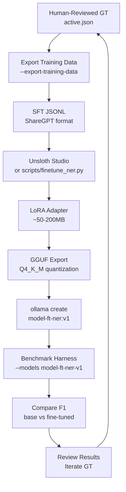

# TRAINING.md

RLHF/fine-tuning pipeline plan using Unsloth Studio for improving extraction quality with human-reviewed ground truth.

## Overview

- **Goal**: Fine-tune local 7-12B models on human-reviewed ground truth to improve extraction quality
- **Tool**: Unsloth Studio (full platform -- Data Recipes, training, monitoring, model comparison, GGUF export)
- **Methodology**: SFT first, then DPO polish, then GRPO with F1 reward (phased)
- **Result**: LoRA adapters exported as GGUF, loaded into Ollama, benchmarked alongside base models

## Current State

- Ground truth editor exists in the benchmark viewer UI (inline editing, saves to disk)
- 12-model ensemble GT with 104 mentions, 4 propositions (from 10 benchmark chunks)
- Provenance tracking complete: document -> chunk -> span -> model -> code_location
- Scoring functions (`score_mentions`, `score_propositions`) can serve as GRPO reward signals
- Leave-one-out scoring prevents tautological self-grading

## Training Pipeline (Planned)



## Phase 1: SFT with Corrected GT (Highest Impact)

- Convert GT chunks to ShareGPT format (system prompt + text -> expected JSON)
- Fine-tune with LoRA (rank=16, alpha=32, QLoRA 4-bit)
- Target models: mistral-7b, qwen2.5-7b, llama3.1-8b
- NER only (SPO needs more GT examples -- only 4 propositions currently)
- Minimum: 10 chunks (current), recommended: 200+ chunks

## Phase 2: DPO with Wrong Extractions as Negatives

- Chosen = human-reviewed GT
- Rejected = model's original (incorrect) extraction
- The extraction fixtures already contain the "rejected" data
- Only worth doing after SFT plateau

## Phase 3: GRPO with F1 Reward Function

- Use `score_mentions()` / `score_propositions()` as reward signal
- No separate reward model needed
- Model generates extractions, scoring computes reward, policy updated

## Unsloth Studio Integration

- **Data Recipes**: may handle GT to training data conversion (evaluate vs custom script)
- **Training UI**: real-time loss monitoring, gradient norms, GPU utilization
- **Model Comparison**: chat-based side-by-side of base vs fine-tuned
- **Export**: GGUF Q4_K_M, Ollama-compatible
- Full Unsloth feature utilization (not just Python API)

## Hardware

| Platform | Tool | Models | Notes |
|----------|------|--------|-------|
| Apple Silicon | mlx-tune | 7B LoRA | ~30 min on M2 16GB |
| Talos K8s GPU | Unsloth Studio | 7-12B | Full CUDA, best option |
| Colab/RunPod | Unsloth | up to 70B | Free tier T4 for 7B QLoRA |

Note: Unsloth Studio is announcing official Apple Silicon/MLX support soon.

## Training Data Format (ShareGPT)

```json
{"conversations": [
  {"from": "system", "value": "You are a named-entity extraction system..."},
  {"from": "human", "value": "<chunk text>"},
  {"from": "gpt", "value": "{\"mentions\": [{\"text\": \"Israel\", \"mention_type\": \"GPE\", ...}]}"}
]}
```

## New Code Required (~220 lines)

| File | Lines | Purpose |
|------|-------|---------|
| tests/shared/training_data.py | ~80 | GT to SFT JSONL converter |
| scripts/finetune_ner.py | ~120 | Unsloth training script (Colab-compatible) |
| benchmark_config.py | ~8 | Fine-tuned model entries |
| .gitignore | ~3 | *.gguf, adapters/, training-data/ |

## Quick Win: Few-Shot Prompt Injection

Before any fine-tuning, replace the static few-shot examples in the extraction prompts with real human-reviewed GT chunks from our domain data. Zero training cost, potential 5-15% F1 improvement.

## Beads Tasks

| ID | Title | Priority | Status |
|----|-------|----------|--------|
| CD-erc3 | Scale GT annotation to 200+ chunks | P1 | Open |
| CD-5uoy | Few-shot prompt injection from GT | P1 | Open |
| CD-foy3 | Training data generator | P2 | Open |
| CD-4c2n | Fine-tune runner (mlx-tune + Unsloth) | P2 | Open |
| CD-1cmr | LoRA adapter field on ModelConfig | P2 | Open |
| CD-hak3 | GRPO reward function using F1 | P3 | Open |

## What Unsloth Does NOT Replace

- Benchmark harness (still orchestrates model comparison)
- GT editor (still needed for human review)
- Scoring code (still measures quality; becomes GRPO reward)
- Dagster pipeline (still runs production extraction)
- Ensemble GT generation (more sophisticated than Data Recipes)

## Related Docs

- [BENCHMARK.md](BENCHMARK.md) -- extraction benchmark reference
- [TESTING.md](TESTING.md) -- integration test pipeline
- [Architecture Diagrams](docs/architecture/pipeline-lineage.md) -- Dagster + LangGraph topology
