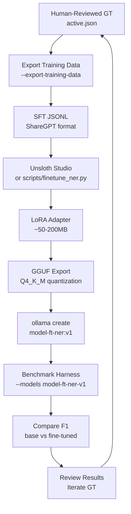

# TRAINING.md

RLHF/fine-tuning pipeline plan using Unsloth Studio for improving extraction quality with human-reviewed ground truth.

## Overview

Two parallel training tracks, each targeting a different model in the extraction spine:

- **LLM track (NER/SPO)**: Fine-tune local 7-12B decoder-only models on human-reviewed ground truth. Tool: Unsloth Studio. Methodology: SFT -> DPO -> GRPO with F1 reward. Result: LoRA adapters exported as GGUF for Ollama.
- **AMR parser track**: Fine-tune amrlib's `parse_xfm_bart_base` (BART-base seq2seq, ~140M params) on Penman ground truth. Tool: amrlib's HuggingFace `Seq2SeqTrainer` wrapper (Unsloth does not apply -- encoder-decoder, not decoder-only). Result: replacement checkpoint loaded by `AmrParseNode`.

The two tracks share the GT editor surface and benchmark harness, but use entirely different data formats and training stacks.

## Current State

- Ground truth editor exists in the benchmark viewer UI (inline editing, saves to disk)
- 12-model ensemble GT with 104 mentions, 4 propositions (from 10 benchmark chunks)
- Provenance tracking complete: document -> chunk -> span -> model -> code_location
- Scoring functions (`score_mentions`, `score_propositions`) can serve as GRPO reward signals
- Leave-one-out scoring prevents tautological self-grading

## Training Pipeline (Planned)



## Phase 1: SFT with Corrected GT (Highest Impact)

- Convert GT chunks to ShareGPT format (system prompt + text -> expected JSON)
- Fine-tune with LoRA (rank=16, alpha=32, QLoRA 4-bit)
- Target models: mistral-7b, qwen2.5-7b, llama3.1-8b
- NER only (SPO needs more GT examples -- only 4 propositions currently)
- Minimum: 10 chunks (current), recommended: 200+ chunks

## Phase 2: DPO with Wrong Extractions as Negatives

- Chosen = human-reviewed GT
- Rejected = model's original (incorrect) extraction
- The extraction fixtures already contain the "rejected" data
- Only worth doing after SFT plateau

## Phase 3: GRPO with F1 Reward Function

- Use `score_mentions()` / `score_propositions()` as reward signal
- No separate reward model needed
- Model generates extractions, scoring computes reward, policy updated

## Parallel Track: BART AMR Parser Fine-Tune

The AMR parser is a seq2seq model (BART-base) that sits downstream of NER consensus and emits Penman notation strings for each clustered mention pack. Fine-tuning it requires a different data shape, loss, and trainer than the LLM SFT/DPO/GRPO chain above.

### Why It Is a Separate Track

| | LLM track | AMR parser track |
|---|---|---|
| Model family | Decoder-only (Mistral/Qwen/Llama) | Encoder-decoder (BART-base via amrlib) |
| Size | 7-12B | ~140M |
| Input | Chunk text | Single sentence |
| Output | JSON (mentions/propositions) | Penman string |
| Loss | Causal LM cross-entropy | Seq2seq cross-entropy |
| Trainer | Unsloth + LoRA + QLoRA 4-bit | HF `Seq2SeqTrainer` (amrlib internal) |
| Deployment | GGUF + Ollama | Checkpoint extracted into `amrlib/data/model_stog/` |

Unsloth is decoder-only-LoRA-shaped and does not apply here. amrlib already wraps `Seq2SeqTrainer` upstream -- the local work is data + config + glue, not a new training loop.

### Current State (AMR Track)

- **No Penman GT in the repo.** GT JSON captures `mentions` + `propositions` only. `Assertion.amr_frame` / `amr_variable` / `amr_role_mapping` / `polarity` / `modality` / `qualifiers` are populated on the predicted side and explicitly documented as not flowing through to the human-reviewed side (`tests/shared/ground_truth.py:138-189`).
- **Parser is not vendored.** `AmrParseNode` lives in external `catalyst-exgraph` (editable path in `libs/dagster-io/pyproject.toml`). Local checkpoint bootstrap is `scripts/dev/install_amrlib_model.py` (`parse_xfm_bart_base-v0_1_0`, ~492 MB).
- **No local training scaffold.** Contrast `scripts/training/unsloth_finetune.py` (exists for LLM track) -- there is no `scripts/training/finetune_amr.py` yet.

### Phase A: Capture Penman Ground Truth

Without Penman GT, none of the later phases are possible. Options, in order of cost:

1. **Bootstrap from existing AMR corpora.** LDC AMR 3.0 (~60K sentence-Penman pairs) and the public Little Prince corpus give a domain-agnostic starting set. Useful as a continued-pretraining mix to prevent catastrophic forgetting, not as the primary fine-tune signal.
2. **Auto-label + human-correct domain sentences.** Run current parser on benchmark chunks, expose the Penman string in the GT editor for inline correction, and persist alongside the existing `mentions` / `propositions` fields. Cheaper than from-scratch annotation; aligns with how the LLM track scaled GT.
3. **From-scratch annotation.** Only justified if (1) and (2) reveal systematic domain failures that LDC + correction cannot reach.

The viewer-UI GT editor needs a new field type for Penman text (multi-line, optional Penman syntax validation via the `penman` package). Storage: extend the corpus `ground-truth.json` schema with an optional `amr_penman` field per sentence/proposition.

### Phase B: Fine-Tune on Domain Penman

- Convert `(sentence, penman)` pairs to amrlib's training JSONL convention.
- Use amrlib's `Trainer` entrypoint (wraps HF `Seq2SeqTrainer`); minimal config -- learning rate, batch size, epochs, mixed precision, output dir.
- Mix ratio: start with ~80% domain / ~20% LDC continued-pretraining to retain general-domain coverage.
- Eval metric: Smatch F1 on a held-out domain split (amrlib ships Smatch scorer).

### Phase C: Round-Trip Validation

The downstream consumer is `AmrToAssertionNode`, which projects Penman onto `Assertion` fields. A parser improvement only matters if those projected fields improve. Add a benchmark that:

- Runs `AmrParseNode` -> `AmrToAssertionNode` end-to-end on a held-out chunk set.
- Scores `amr_frame` / `polarity` / `modality` accuracy against GT.
- Flags Penman strings that parse but project to empty/malformed Assertions.

This is the AMR equivalent of the F1 benchmark harness in the LLM track.

### Deployment

- New checkpoint: tag as `parse_xfm_bart_base-domain-vN`, publish to internal artifact storage (the existing amrlib GitHub release pattern works but is read-only).
- Expose model path as config on `AmrParseNode` in `catalyst-exgraph` so the swap does not require a code change.
- Update `scripts/dev/install_amrlib_model.py` to accept a `--checkpoint` arg pointing at the new artifact.

### Hardware

BART-base fine-tune is far cheaper than the 7-12B LLMs: single GPU (T4/A10/M-series with MPS), single-digit hours on 1-10K Penman pairs. No QLoRA needed -- full fine-tune is feasible.

## Unsloth Studio Integration

- **Data Recipes**: may handle GT to training data conversion (evaluate vs custom script)
- **Training UI**: real-time loss monitoring, gradient norms, GPU utilization
- **Model Comparison**: chat-based side-by-side of base vs fine-tuned
- **Export**: GGUF Q4_K_M, Ollama-compatible
- Full Unsloth feature utilization (not just Python API)

## Hardware

| Platform | Tool | Models | Notes |
|----------|------|--------|-------|
| Apple Silicon | mlx-tune | 7B LoRA | ~30 min on M2 16GB |
| Talos K8s GPU | Unsloth Studio | 7-12B | Full CUDA, best option |
| Colab/RunPod | Unsloth | up to 70B | Free tier T4 for 7B QLoRA |

Note: Unsloth Studio is announcing official Apple Silicon/MLX support soon.

## Training Data Format (ShareGPT)

```json
{"conversations": [
  {"from": "system", "value": "You are a named-entity extraction system..."},
  {"from": "human", "value": "<chunk text>"},
  {"from": "gpt", "value": "{\"mentions\": [{\"text\": \"Israel\", \"mention_type\": \"GPE\", ...}]}"}
]}
```

## New Code Required (~220 lines)

LLM track:

| File | Lines | Purpose |
|------|-------|---------|
| tests/shared/training_data.py | ~80 | GT to SFT JSONL converter |
| scripts/finetune_ner.py | ~120 | Unsloth training script (Colab-compatible) |
| benchmark_config.py | ~8 | Fine-tuned model entries |
| .gitignore | ~3 | *.gguf, adapters/, training-data/ |

AMR parser track:

| File | Lines | Purpose |
|------|-------|---------|
| viewer-ui Penman field | ~60 | GT editor support for Penman annotation + `penman` validation |
| corpus schema extension | ~20 | Optional `amr_penman` field in `ground-truth.json` |
| scripts/training/amr_data.py | ~80 | `(sentence, penman)` -> amrlib JSONL converter; LDC mix |
| scripts/training/finetune_amr.py | ~100 | amrlib Trainer entrypoint + Smatch eval |
| tests/test_amr_roundtrip_benchmark.py | ~80 | Penman -> Assertion projection scoring |
| catalyst-exgraph AmrParseNode config | ~10 | Model path / checkpoint override (external repo) |

## Quick Win: Few-Shot Prompt Injection

Before any fine-tuning, replace the static few-shot examples in the extraction prompts with real human-reviewed GT chunks from our domain data. Zero training cost, potential 5-15% F1 improvement.

## Beads Tasks

LLM track:

| ID | Title | Priority | Status |
|----|-------|----------|--------|
| CD-erc3 | Scale GT annotation to 200+ chunks | P1 | Open |
| CD-5uoy | Few-shot prompt injection from GT | P1 | Open |
| CD-foy3 | Training data generator | P2 | Open |
| CD-4c2n | Fine-tune runner (mlx-tune + Unsloth) | P2 | Open |
| CD-1cmr | LoRA adapter field on ModelConfig | P2 | Open |
| CD-hak3 | GRPO reward function using F1 | P3 | Open |

AMR parser track (to create):

| ID | Title | Priority | Status |
|----|-------|----------|--------|
| TBD | Extend GT editor + corpus schema for Penman annotation | P2 | Not created |
| TBD | Penman GT bootstrap from current parser output | P2 | Not created |
| TBD | amrlib fine-tune script + LDC mix loader | P3 | Not created |
| TBD | AmrParseNode checkpoint config override (catalyst-exgraph) | P3 | Not created |
| TBD | Round-trip benchmark: Penman -> Assertion projection F1 | P3 | Not created |

## What Unsloth Does NOT Replace

- Benchmark harness (still orchestrates model comparison)
- GT editor (still needed for human review)
- Scoring code (still measures quality; becomes GRPO reward)
- Dagster pipeline (still runs production extraction)
- Ensemble GT generation (more sophisticated than Data Recipes)

## Related Docs

- [BENCHMARK.md](BENCHMARK.md) -- extraction benchmark reference
- [TESTING.md](TESTING.md) -- integration test pipeline
- [Architecture Diagrams](docs/architecture/pipeline-lineage.md) -- Dagster + LangGraph topology
