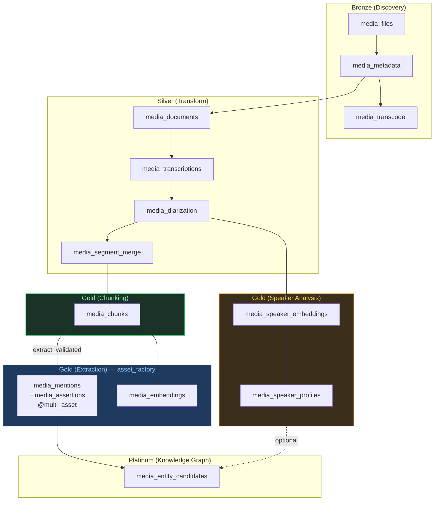
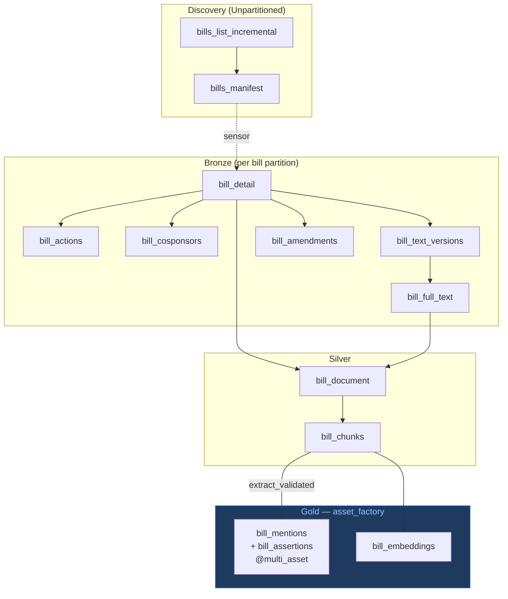
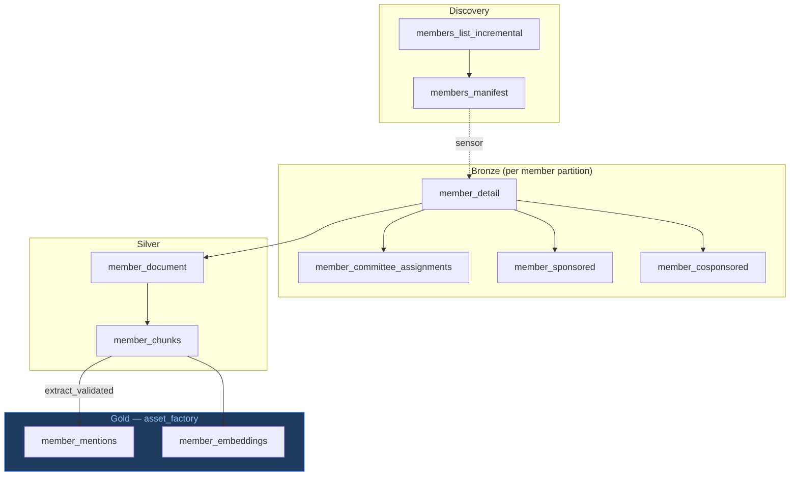
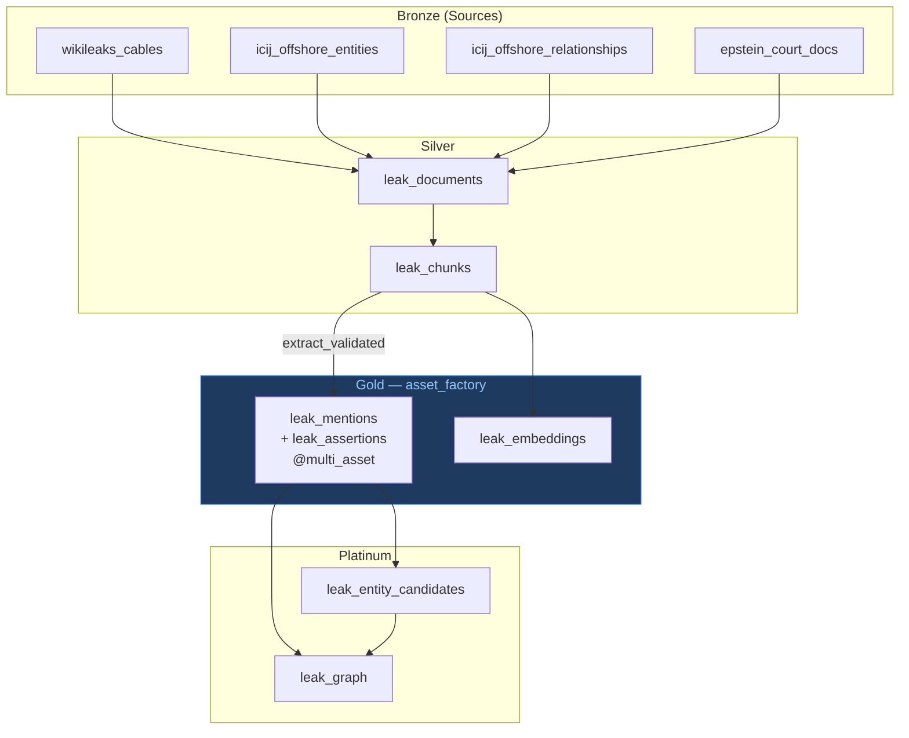
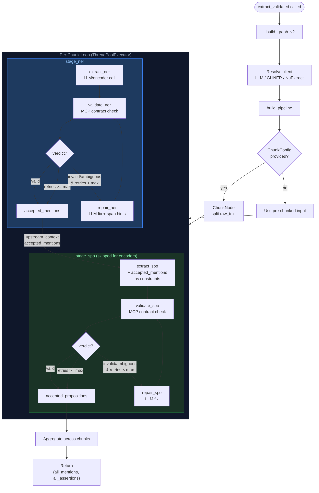
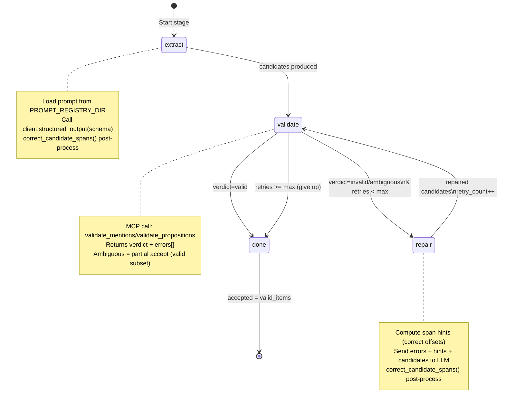
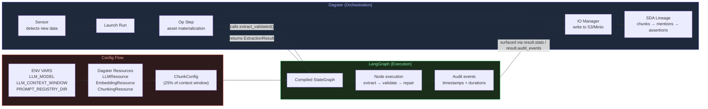
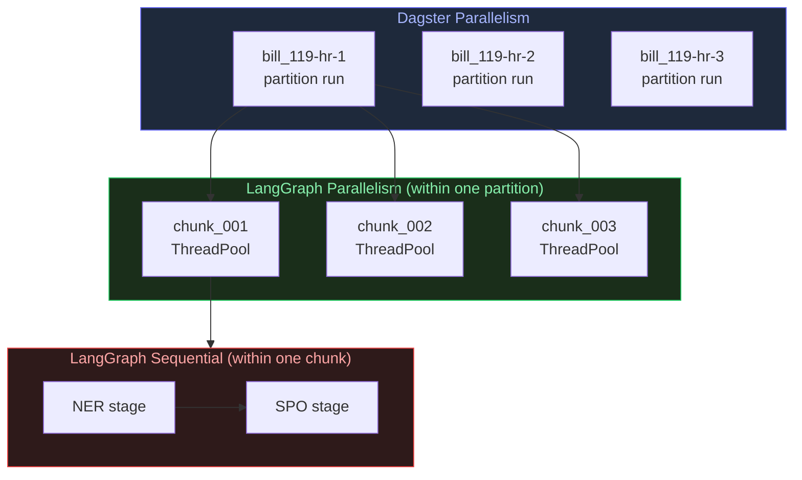

# Pipeline Lineage: Dagster SDAs + LangGraph Execution

## Dagster Asset Lineage (per code location)

### Media-Ingest

### Congress-Data (Bill Pipeline)

### Congress-Data (Member Pipeline)

### Open-Leaks

---

## LangGraph Execution Chain (inside extract_validated)

### Pipeline Topology

### Stage Subgraph Detail (NER or SPO)

### How Dagster and LangGraph Interact

### Parallelism Boundaries

| Scope | Owner | Mechanism |
|-------|-------|-----------|
| Cross-document | Dagster | Partition runs (separate K8s pods) |
| Cross-chunk (within doc) | LangGraph | ThreadPoolExecutor (max_concurrency=5) |
| Cross-stage (within chunk) | LangGraph | Sequential (NER must complete before SPO) |
| Repair loop (within stage) | LangGraph | Conditional edges (validate → repair → validate) |
