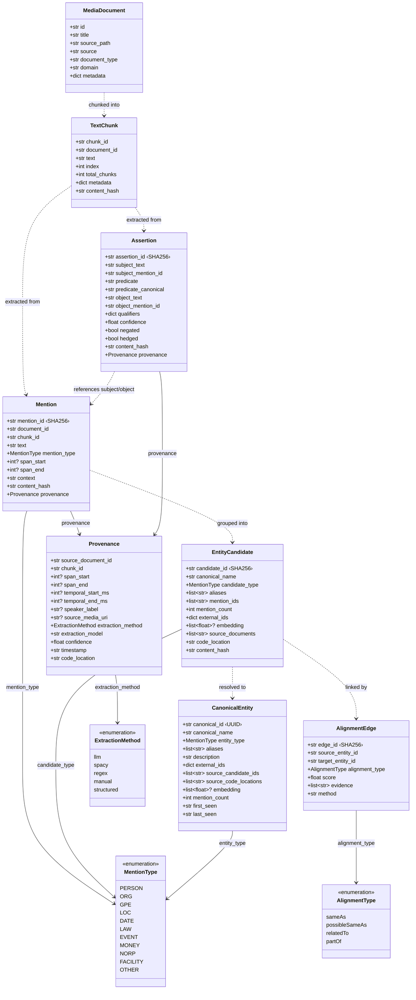
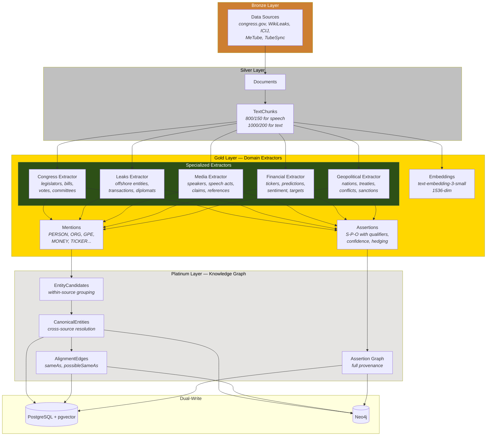

# Catalyst-Data Domain Model UML

## Entity Relationship Diagram



## Extraction Pipeline Flow



## Multi-Extractor Architecture

```mermaid
flowchart LR
    subgraph Input
        CHUNK[TextChunk<br/><i>text, metadata,<br/>speaker, language</i>]
    end

    subgraph ExtractorRegistry["Extractor Registry"]
        direction TB
        REG[ExtractorConfig<br/><i>name, prompt, schema,<br/>predicate_mappings,<br/>mention_types</i>]
    end

    subgraph LLM["LLM Pipeline"]
        direction TB
        PROMPT[Domain Prompt<br/><i>loaded from registry</i>]
        CHAIN[Structured Output Chain<br/><i>with_structured_output(Schema)</i>]
        BATCH[invoke_batch<br/><i>parallel chunk processing</i>]
    end

    subgraph Validation["Contract Validation (MCP)"]
        direction TB
        VM[validate_mentions<br/><i>span check, type check,<br/>duplicate detection</i>]
        VP[validate_propositions<br/><i>reference check, predicate<br/>format, score range</i>]
        RP[generate_repair_plan<br/><i>auto-fix common issues</i>]
    end

    subgraph Output["Domain Models"]
        MEN2[list~Mention~<br/><i>with Provenance</i>]
        ASS2[list~Assertion~<br/><i>with Provenance +<br/>normalized predicates</i>]
    end

    CHUNK --> REG
    REG --> PROMPT --> CHAIN --> BATCH
    BATCH --> VM & VP
    VM --> RP
    VP --> RP
    RP --> MEN2 & ASS2

    style ExtractorRegistry fill:#4a1942,color:#fff
    style Validation fill:#0e2f4a,color:#fff
```

## Extractor Configuration Pattern

Each domain extractor is defined by:

```yaml
# Example: FinancialDataExtractor
name: financial
prompt_id: "extractors/financial"
mention_schema: MentionExtractionResult  # or extended FinancialMentionResult
assertion_schema: AssertionExtractionResult  # or extended FinancialAssertionResult
mention_types:
  - PERSON    # analysts, fund managers
  - ORG       # companies, funds, exchanges
  - MONEY     # prices, targets, amounts
  - TICKER    # $AAPL, $SPY (NEW)
  - DATE      # earnings dates, expiry
  - EVENT     # earnings calls, FOMC meetings
predicate_mappings:
  "predicts": "predicts"
  "recommends": "recommends"
  "upgrades": "upgrades"
  "downgrades": "downgrades"
  "buys": "buys"
  "sells": "sells"
  "is bullish on": "bullish"
  "is bearish on": "bearish"
  "targets": "price_target"
  "expects": "predicts"
qualifiers:
  - time       # "by Q3 2026"
  - condition  # "if the Fed cuts rates"
  - price      # "$200 price target" (NEW)
  - timeframe  # "within 6 months" (NEW)
  - conviction # "high conviction" (NEW)
```

```yaml
# Example: GeopoliticalAnalystExtractor
name: geopolitical
prompt_id: "extractors/geopolitical"
mention_types:
  - PERSON    # heads of state, diplomats
  - ORG       # NATO, UN, EU, BRICS
  - GPE       # nations, regions
  - EVENT     # summits, conflicts, elections
  - LAW       # treaties, sanctions, resolutions
  - NORP      # ethnic/religious groups
predicate_mappings:
  "sanctions": "sanctions"
  "invades": "military_action"
  "allies with": "allied_with"
  "threatens": "threatens"
  "negotiates": "negotiates"
  "withdraws from": "withdraws"
  "signs": "ratifies"
  "vetoes": "vetoes"
  "condemns": "condemns"
  "recognizes": "recognizes"
qualifiers:
  - time       # "during the G7 summit"
  - location   # "in the South China Sea"
  - condition  # "unless sanctions are lifted"
  - manner     # "unilaterally"
```
