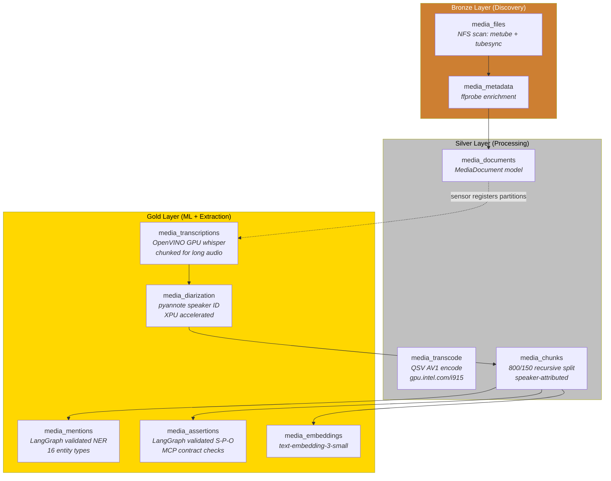
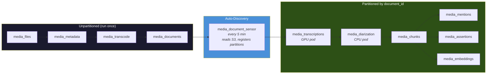
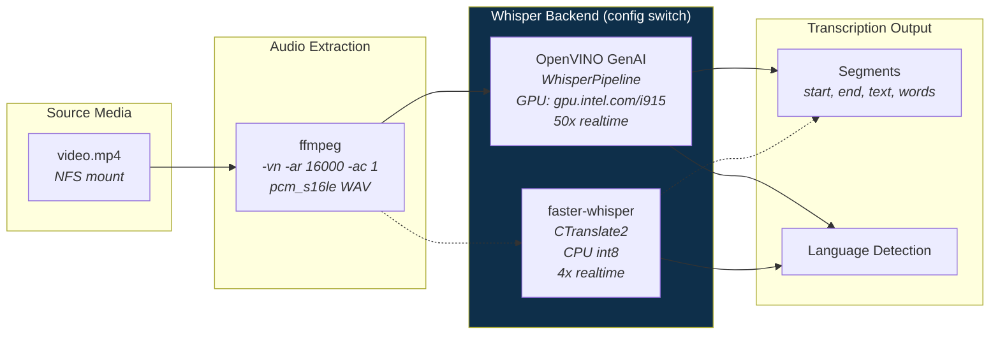
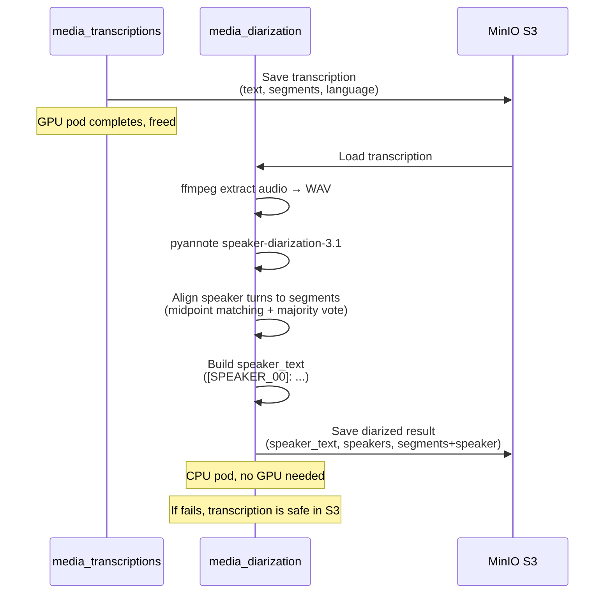
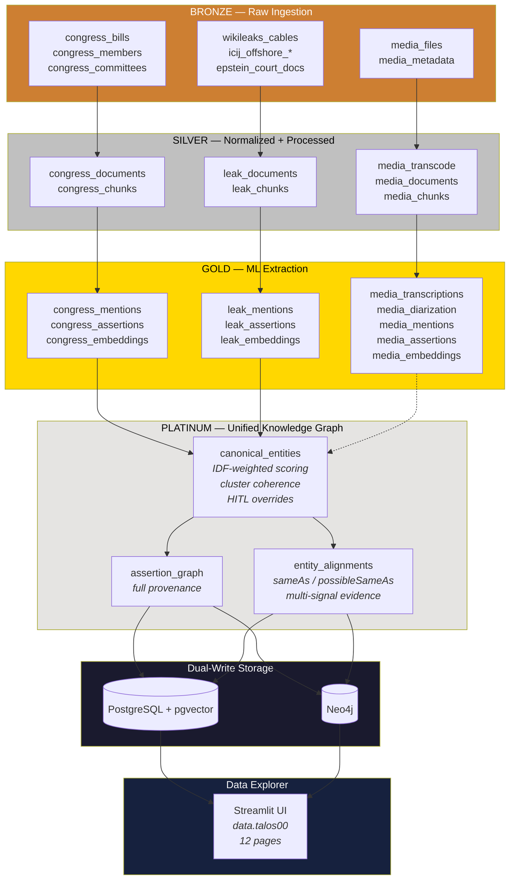
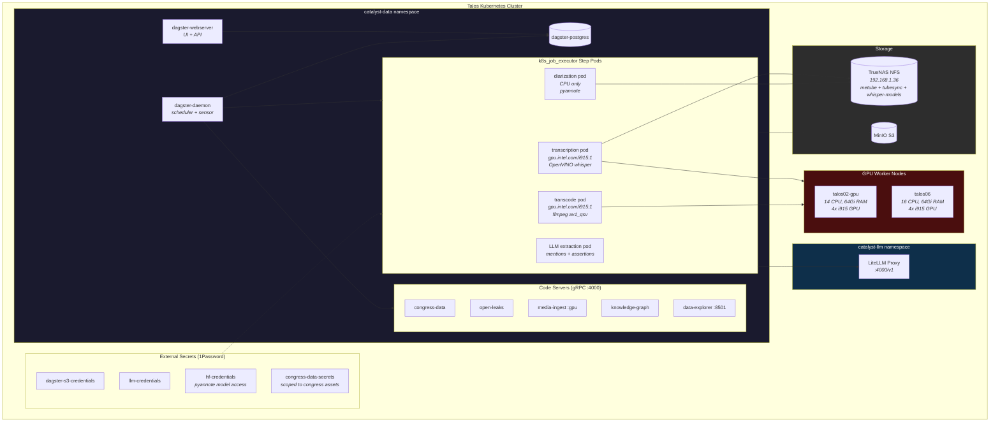

# Media Ingest & Transcription Architecture

## 1. Media Ingest Asset Pipeline (10 Assets)



## 2. Partitioning Model



## 3. S3 Storage Layout

```
s3://catalyst-data/
├── bronze/default/media/
│   ├── media_files/data.jsonl
│   └── media_metadata/data.jsonl (not in use?)
├── silver/default/media/
│   ├── media_transcode/data.jsonl
│   ├── media_documents/data.jsonl
│   └── media_chunks/{document_id}/data.json       ← per partition
├── gold/default/media/
│   ├── media_transcriptions/{document_id}/data.json
│   ├── media_diarization/{document_id}/data.json
│   ├── media_mentions/{document_id}/data.json
│   ├── media_assertions/{document_id}/data.json
│   └── media_embeddings/{document_id}/data.json
```

## 4. Transcription Backend Architecture



## 5. Diarization Pipeline



## 6. Catalyst-Data Full Domain Model



## 7. K8s Runtime Architecture



## 8. Data Models

### Transcription Output (per partition)
```json
{
  "document_id": "media-metube-interview-001",
  "title": "Interview Episode 42",
  "text": "Full concatenated text...",
  "language": "en",
  "language_probability": 0.98,
  "segments": [
    {"start": 0.0, "end": 5.3, "text": "Welcome to the show", "words": [...]}
  ],
  "segment_count": 150,
  "duration_s": 3600.0,
  "transcription_time_s": 72.0,
  "source_path": "/data/metube/youtube.com/interview.mp4"
}
```

### Diarization Output (extends transcription)
```json
{
  "...all transcription fields...",
  "speaker_text": "[SPEAKER_00]: Welcome to the show...\n[SPEAKER_01]: Thanks for having me...",
  "speaker_count": 2,
  "speakers": ["SPEAKER_00", "SPEAKER_01"],
  "segments": [
    {"start": 0.0, "end": 5.3, "text": "Welcome to the show", "speaker": "SPEAKER_00"}
  ],
  "diarization_time_s": 180.0
}
```

### Assertion Output (speech-act predicates)
```json
{
  "subject_text": "Senator Warren",
  "predicate": "claims",
  "predicate_canonical": "claims",
  "object_text": "the bill will reduce costs by 30%",
  "qualifiers": {"time": "during the hearing", "source_attribution": "SPEAKER_01"},
  "confidence": 0.85,
  "negated": false,
  "hedged": true,
  "provenance": {
    "source_document_id": "media-metube-interview-001",
    "chunk_id": "media-metube-interview-001:chunk-5",
    "temporal_start_ms": 45000,
    "temporal_end_ms": 52000,
    "speaker_label": "SPEAKER_01"
  }
}
```
