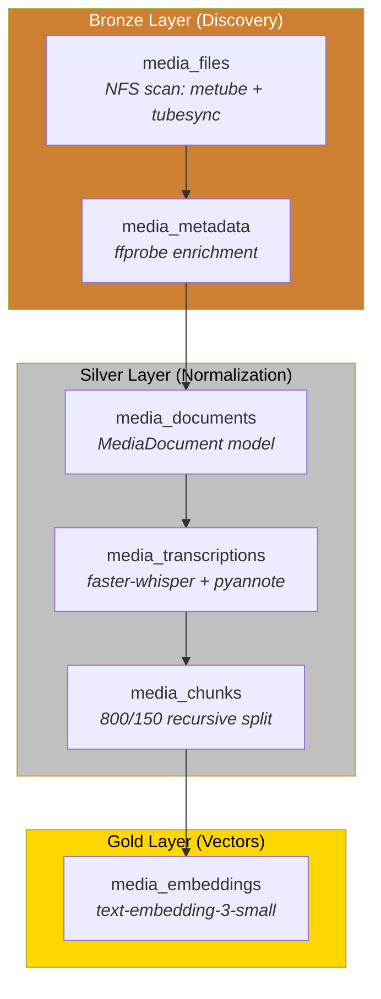
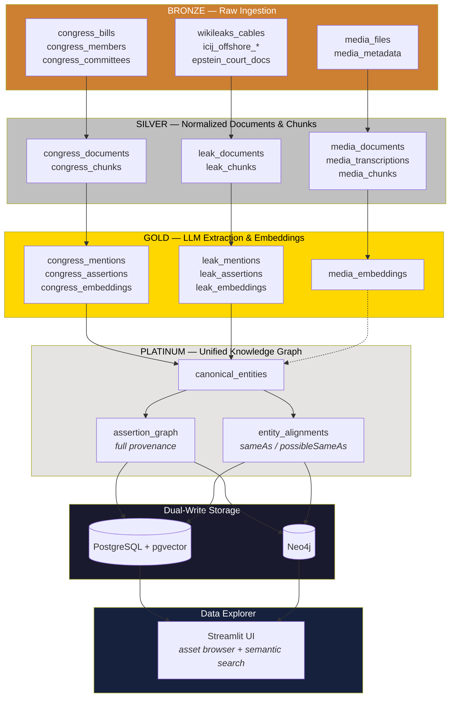
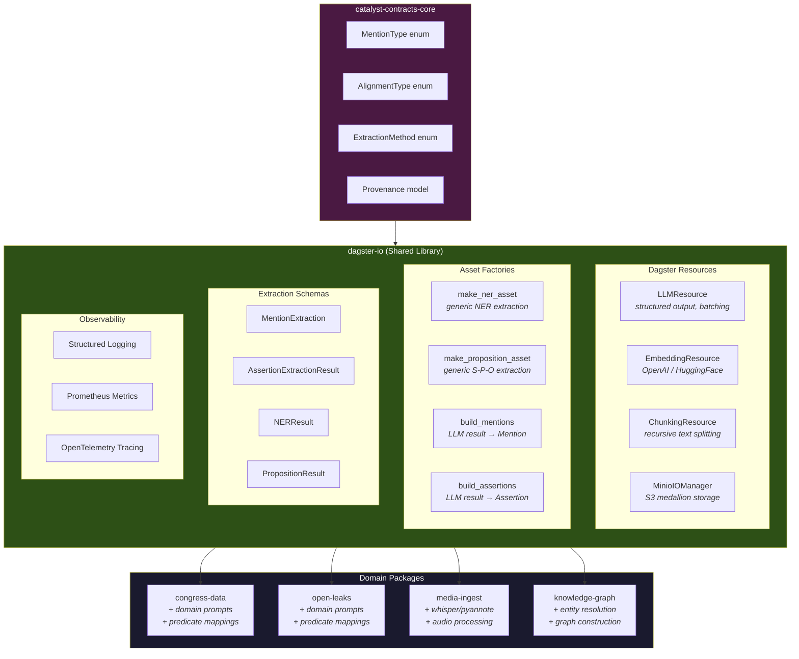
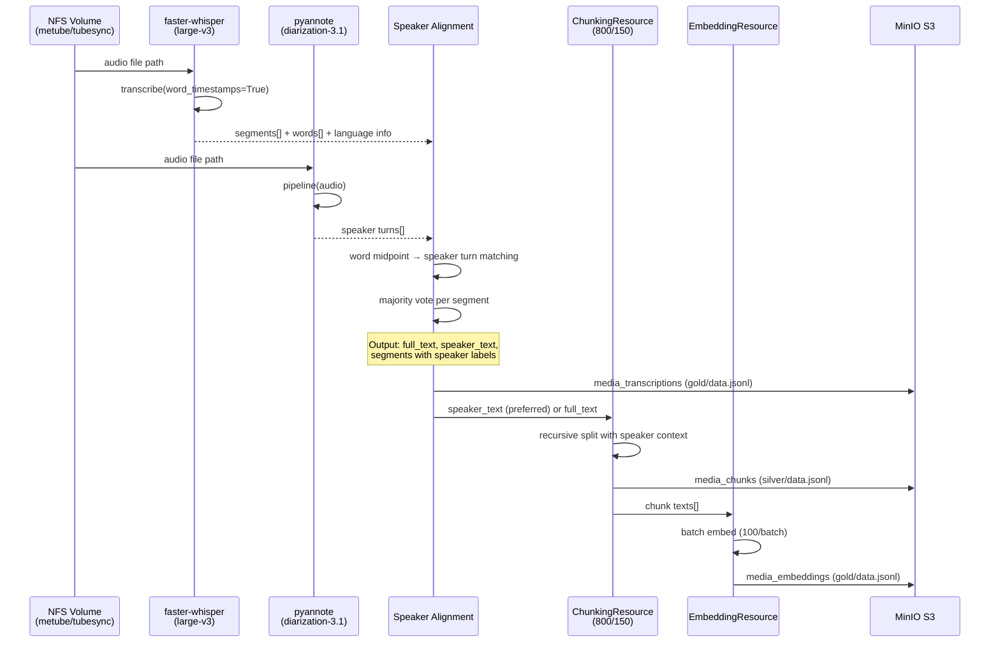
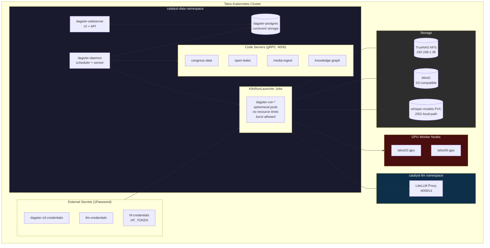

# Media Ingest & Transcription Architecture

## 1. Media Ingest Asset Pipeline (Internal)



## 2. Transcription as a Cross-Domain Service

```mermaid
graph LR
    subgraph Sources["Media Sources"]
        MeTube[MeTube<br/><i>YouTube downloads</i>]
        TubeSync[TubeSync<br/><i>RSS video sync</i>]
        Future1[Podcast Feeds<br/><i>planned</i>]
        Future2[Meeting Recordings<br/><i>planned</i>]
    end

    subgraph TranscriptionService["Transcription Service Layer"]
        FW[faster-whisper<br/><i>large-v3 / int8</i>]
        PA[pyannote<br/><i>speaker-diarization-3.1</i>]
        FW --> PA
    end

    subgraph Output["Transcription Output"]
        FT[Full Text]
        ST[Speaker-Attributed Text<br/><i>[SPEAKER_00]: ...</i>]
        SEG[Timed Segments<br/><i>word-level timestamps</i>]
        SPK[Speaker Metadata<br/><i>count, IDs</i>]
    end

    MeTube --> TranscriptionService
    TubeSync --> TranscriptionService
    Future1 -.-> TranscriptionService
    Future2 -.-> TranscriptionService

    TranscriptionService --> FT
    TranscriptionService --> ST
    TranscriptionService --> SEG
    TranscriptionService --> SPK

    subgraph Consumers["Any Domain Can Consume"]
        MI[media-ingest<br/><i>media_transcriptions</i>]
        CD[congress-data<br/><i>hearing transcripts</i>]
        OL[open-leaks<br/><i>deposition audio</i>]
        KG[knowledge-graph<br/><i>speaker-entity linking</i>]
    end

    FT --> MI
    ST --> MI
    FT -.-> CD
    FT -.-> OL
    SPK -.-> KG

    style TranscriptionService fill:#4a90d9,color:#fff
    style Consumers fill:#2d2d2d,color:#fff
```

## 3. Catalyst-Data Full Domain Model (Medallion Architecture)



## 4. Shared Infrastructure (dagster-io)



## 5. Transcription Data Flow (Detailed)



## 6. K8s Runtime Architecture


