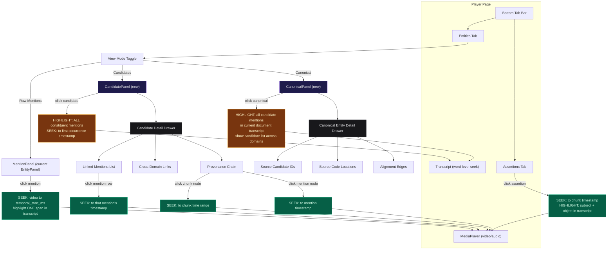

# Entity Stack Viewer — Frontend Update Plan

**Date:** 2026-04-09
**Status:** Design
**Scope:** `packages/media-ingest/viewer-ui/` (React/TS) + `packages/media-ingest/src/media_ingest/viewer/` (Python API)

---

## 1. Overview

The media viewer currently shows raw NER mentions grouped by type (PERSON, ORG, GPE, etc.) in the EntityPanel.
After the concordance update, the pipeline now produces three tiers of entity data:

| Layer   | Asset                      | Storage           | Data Shape                                        |
|---------|----------------------------|-------------------|---------------------------------------------------|
| Gold    | `media_mentions`           | S3 (JSONL)        | `Mention` — individual entity spans from text      |
| Gold    | `media_entity_candidates`  | S3 (JSONL)        | `EntityCandidate` — grouped mentions within media  |
| Platinum| `canonical_entities`       | PostgreSQL + Neo4j| `CanonicalEntity` — cross-source resolved entities |
| Platinum| `entity_alignments`        | PostgreSQL + Neo4j| `AlignmentEdge` — cross-source alignment links     |

The viewer must surface this full entity stack so users can drill from canonical entities down to the source text that produced them.

---

## 2. UI Flow: Entity Drill-Down with Click-Through Navigation

Every level of the entity hierarchy supports click-through to the relevant
temporal position in the video. This is the defining feature of the media
viewer -- what the Streamlit data-explorer cannot do.



---

## 3. New TypeScript Types

Add to `viewer-ui/src/types/media.ts`:

```typescript
/** Gold: grouped mentions resolved within the media_ingest code location */
export interface EntityCandidate {
  candidate_id: string;
  canonical_name: string;
  candidate_type: string;       // MentionType enum value
  aliases: string[];
  mention_ids: string[];
  mention_count: number;
  source_documents: string[];
  code_location: string;        // always "media_ingest" for this viewer
  embedding?: number[] | null;  // omitted in API response for payload size
  content_hash: string;
}

/** Platinum: cross-source resolved entity from the knowledge-graph service */
export interface CanonicalEntity {
  canonical_id: string;
  canonical_name: string;
  entity_type: string;
  aliases: string[];
  description: string;
  source_candidate_ids: string[];
  source_code_locations: string[];  // e.g. ["media_ingest", "congress_data", "open_leaks"]
  mention_count: number;
  first_seen: string;   // ISO datetime
  last_seen: string;    // ISO datetime
}

/** Platinum: cross-source alignment edge */
export interface AlignmentEdge {
  edge_id: string;
  source_entity_id: string;     // candidate_id from one source
  target_entity_id: string;     // candidate_id from another source
  alignment_type: "sameAs" | "possibleSameAs";
  score: number;
  evidence: string[];           // e.g. ["exact_name", "jaccard", "embedding"]
  method: string;
}

/** Provenance chain for an entity — assembled by the API */
export interface EntityProvenance {
  canonical_entity: CanonicalEntity | null;
  candidates: EntityCandidate[];
  mentions: Mention[];
  assertions: Assertion[];      // assertions where entity is subject or object
  alignment_edges: AlignmentEdge[];
  cross_domain_entities: CrossDomainLink[];
}

/** A link to an entity in another code location (congress, leaks) */
export interface CrossDomainLink {
  code_location: string;
  candidate_id: string;
  canonical_name: string;
  candidate_type: string;
  alignment_type: "sameAs" | "possibleSameAs";
  score: number;
}
```

---

## 4. New API Endpoints

### 4.1 Endpoints in `media_ingest/viewer/routes/api.py`

| Method | Path | Source | Description |
|--------|------|--------|-------------|
| GET | `/viewer/api/documents/{id}/entity-candidates` | S3 | Entity candidates for this document |
| GET | `/viewer/api/entity-candidates/{candidate_id}` | S3 | Single entity candidate by ID |
| GET | `/viewer/api/entity-candidates/{candidate_id}/provenance` | S3 + PG | Full provenance chain |
| GET | `/viewer/api/canonical-entities` | PostgreSQL | All canonical entities (paginated) |
| GET | `/viewer/api/canonical-entities/{canonical_id}` | PostgreSQL | Single canonical entity detail |
| GET | `/viewer/api/canonical-entities/{canonical_id}/candidates` | PostgreSQL | Source candidates for a canonical entity |
| GET | `/viewer/api/canonical-entities/{canonical_id}/alignments` | PostgreSQL | Alignment edges for a canonical entity |
| GET | `/viewer/api/documents/{id}/chunk-times` | S3 (computed) | Chunk-to-segment temporal index for click-through seek |

### 4.2 Data source per endpoint

**S3 (MinIO)** — gold-layer partitioned data:
- `media_entity_candidates` is stored at `gold/default/media/media_entity_candidates/{partition_key}/data.jsonl`
- `media_mentions` is stored at `gold/default/media/media_mentions/{partition_key}/data.jsonl`
- `media_assertions` is stored at `gold/default/media/media_assertions/{partition_key}/data.jsonl`

**PostgreSQL** (`knowledge_graph` database) — platinum-layer cross-source data:
- `canonical_entities` table — canonical_id, canonical_name, entity_type, aliases, embedding, mention_count
- `alignment_edges` table — edge_id, source_entity_id, target_entity_id, alignment_type, score, evidence
- `assertions` table — assertion_id, subject_canonical_id, predicate, object_canonical_id, qualifiers

### 4.3 Implementation notes

The `S3DataService` needs new methods:

```python
# New S3 key prefix
ENTITY_CANDIDATES_PREFIX = f"{_GOLD_PREFIX}/media_entity_candidates"

class S3DataService:
    # ... existing methods ...

    def load_entity_candidates(self, document_id: str) -> list[dict]:
        """Load entity candidates for a document from the gold layer."""
        key = f"{ENTITY_CANDIDATES_PREFIX}/{document_id}/data.jsonl"
        return self._load_jsonl(key)

    def load_all_entity_candidates(self) -> list[dict]:
        """Load entity candidates across all partitions (for search)."""
        # List all partition keys under the prefix, then load each
        ...
```

A new `PGDataService` is needed for platinum-layer queries:

```python
class PGDataService:
    """Reads canonical entities and alignment edges from PostgreSQL."""

    def list_canonical_entities(self, limit=100, offset=0, entity_type=None) -> list[dict]:
        """Paginated list of canonical entities."""

    def get_canonical_entity(self, canonical_id: str) -> dict | None:
        """Single canonical entity by ID."""

    def get_candidates_for_canonical(self, canonical_id: str) -> list[dict]:
        """Get source candidate IDs linked to a canonical entity."""

    def get_alignment_edges(self, candidate_id: str) -> list[dict]:
        """Get alignment edges involving a candidate."""

    def get_assertions_for_entity(self, canonical_id: str) -> list[dict]:
        """Get assertions where entity is subject or object."""
```

---

## 5. New and Modified React Components

### 5.1 Modified: `EntityPanel.tsx` -> View mode toggle

**Current behavior:** Takes raw `Mention[]`, groups by type, shows count per unique text.

**New behavior:** Add a view-mode toggle at the top:

```
[ Mentions | Candidates | Canonical ]
```

- **Mentions mode** (default): Current behavior, unchanged.
- **Candidates mode**: Fetch entity candidates for this document, show grouped by type with canonical_name, alias count, mention_count. Clicking a candidate opens the detail drawer.
- **Canonical mode**: Fetch canonical entities for the entity candidates in this document (requires a backend join), show cross-source resolved entities.

The component props expand to:

```typescript
interface EntityPanelProps {
  documentId: string;
  mentions: Mention[];
  entityCandidates: EntityCandidate[];
  onMentionClick?: (mention: Mention) => void;
  onCandidateClick?: (candidate: EntityCandidate) => void;
  onCanonicalClick?: (canonical: CanonicalEntity) => void;
  className?: string;
}
```

### 5.2 New: `CandidateList.tsx`

Displays a list of EntityCandidate objects, grouped by candidate_type:

```
PERSON (4 candidates, 23 mentions)
  [v] Jeffrey Epstein — 12 mentions, 3 aliases
      Aliases: Jeff Epstein, Epstein, J. Epstein
  [ ] Ghislaine Maxwell — 8 mentions, 2 aliases
  ...

ORG (2 candidates, 7 mentions)
  [v] JPMorgan Chase — 5 mentions, 1 alias
  ...
```

Props:
```typescript
interface CandidateListProps {
  candidates: EntityCandidate[];
  onSelect: (candidate: EntityCandidate) => void;
  onSeekToCandidate?: (candidate: EntityCandidate) => void;  // click -> seek + multi-highlight
  selectedId?: string;
  className?: string;
}
```

### 5.3 New: `CandidateDetailDrawer.tsx`

Slide-out drawer or expandable panel showing full detail for a selected EntityCandidate:

**Sections:**
1. **Identity** — canonical_name, candidate_type, candidate_id
2. **Aliases** — pill/chip list of all aliases with individual mention counts
3. **Source Mentions** — expandable list of linked mentions with chunk context
4. **Cross-Domain Links** — if this candidate has alignment edges to congress/leaks candidates, show them with score badges
5. **Provenance Chain** — visual breadcrumb: Chunks -> Mentions -> EntityCandidate -> CanonicalEntity
6. **Assertions** — assertions where this entity appears as subject or object

Props:
```typescript
interface CandidateDetailDrawerProps {
  candidate: EntityCandidate;
  provenance: EntityProvenance | null;
  isLoading: boolean;
  onClose: () => void;
  onMentionClick?: (mention: Mention) => void;       // seek to mention timestamp
  onSeekToChunk?: (chunkId: string) => void;          // seek to chunk time range
  onHighlightTexts?: (texts: string[]) => void;       // multi-string highlight
}
```

### 5.4 New: `CanonicalEntityPanel.tsx`

For the "Canonical" view mode — shows cross-source resolved entities relevant to this document:

```
Jeffrey Epstein (PERSON)  — 45 mentions across 3 sources
  Sources: media_ingest, congress_data, open_leaks
  Aliases: Jeff Epstein, Epstein, J. Epstein, Jeffrey E. Epstein
  [View Full Profile] [View in Knowledge Graph]
```

Props:
```typescript
interface CanonicalEntityPanelProps {
  documentId: string;
  className?: string;
}
```

This component fetches canonical entities from the PG-backed API endpoint and cross-references against the document's entity candidates.

### 5.5 New: `ProvenanceChain.tsx`

Visual component showing the full lineage of an entity:

```
Source Chunk        Mention              EntityCandidate      CanonicalEntity
  chunk_abc123  ->  "Jeff Epstein"   ->  Jeffrey Epstein  ->  Jeffrey Epstein
  chunk_def456  ->  "Epstein"        ->        |                     |
  chunk_ghi789  ->  "J. Epstein"     ->        |                     |
                                                                     |
                                          [congress_data]            |
                                          Jeffrey Epstein  ----------+
                                          [open_leaks]               |
                                          J. Epstein      -----------+
```

Rendered as a horizontal DAG with clickable nodes. Clicking a chunk seeks the transcript to that segment. Clicking a mention highlights it.

### 5.6 New: `CrossDomainBadge.tsx`

Small badge component shown next to entity candidates that have cross-domain links:

```
Jeffrey Epstein  [CONGRESS] [LEAKS]
```

Each badge is colored by source and shows the alignment score on hover.

### 5.7 New: `AlignmentScoreBadge.tsx`

Shows the alignment type and score:
- sameAs (>=0.90): solid green badge
- possibleSameAs (0.65-0.89): amber outline badge

### 5.8 Modified: `Player.tsx`

Changes:
1. Add `entityCandidates` to the data fetched by `useDocumentData`
2. Pass `documentId` to `EntityPanel`
3. Add a third bottom tab option for "Canonical Entities" (or integrate into existing entity tab via view-mode toggle)

### 5.9 Modified: `useDocumentData.ts`

Add a new query for entity candidates:

```typescript
const entityCandidatesQuery = useQuery({
  queryKey: ["entity-candidates", id],
  queryFn: () => fetchEntityCandidates(id),
  enabled,
  staleTime: 60_000,
});
```

Return `entityCandidates: entityCandidatesQuery.data ?? []` in the hook output.

### 5.10 New: `useEntityProvenance.ts`

Hook that fetches the full provenance chain for a selected entity candidate:

```typescript
export function useEntityProvenance(candidateId: string | undefined) {
  return useQuery({
    queryKey: ["entity-provenance", candidateId],
    queryFn: () => fetchEntityProvenance(candidateId!),
    enabled: !!candidateId,
    staleTime: 120_000,
  });
}
```

---

## 6. API Client Additions

Add to `viewer-ui/src/api/client.ts`:

```typescript
export function fetchEntityCandidates(documentId: string): Promise<EntityCandidate[]> {
  return apiFetch<EntityCandidate[]>(
    `/documents/${encodeURIComponent(documentId)}/entity-candidates`
  );
}

export function fetchEntityProvenance(candidateId: string): Promise<EntityProvenance> {
  return apiFetch<EntityProvenance>(
    `/entity-candidates/${encodeURIComponent(candidateId)}/provenance`
  );
}

export function fetchCanonicalEntities(params?: {
  limit?: number;
  offset?: number;
  entity_type?: string;
}): Promise<CanonicalEntity[]> {
  const qs = new URLSearchParams();
  if (params?.limit) qs.set("limit", String(params.limit));
  if (params?.offset) qs.set("offset", String(params.offset));
  if (params?.entity_type) qs.set("entity_type", params.entity_type);
  return apiFetch<CanonicalEntity[]>(`/canonical-entities?${qs}`);
}

export function fetchCanonicalEntity(canonicalId: string): Promise<CanonicalEntity> {
  return apiFetch<CanonicalEntity>(
    `/canonical-entities/${encodeURIComponent(canonicalId)}`
  );
}

export function fetchAlignmentEdges(candidateId: string): Promise<AlignmentEdge[]> {
  return apiFetch<AlignmentEdge[]>(
    `/canonical-entities/${encodeURIComponent(candidateId)}/alignments`
  );
}
```

---

## 7. Data Flow: What Comes from S3 vs PostgreSQL

```
┌──────────────────────────────────────────────────────────────────────┐
│                          S3 (MinIO)                                  │
│                                                                      │
│  gold/default/media/media_mentions/{partition}/data.jsonl            │
│  gold/default/media/media_entity_candidates/{partition}/data.jsonl   │
│  gold/default/media/media_assertions/{partition}/data.jsonl          │
│                                                                      │
│  Used for: per-document mentions, entity candidates, assertions      │
│  Accessed via: S3DataService (existing + new methods)                │
└──────────────────────────────────────────────────────────────────────┘

┌──────────────────────────────────────────────────────────────────────┐
│                     PostgreSQL (knowledge_graph DB)                   │
│                                                                      │
│  canonical_entities table                                            │
│    - canonical_id, canonical_name, entity_type, aliases,             │
│      embedding (pgvector), mention_count, first_seen, last_seen      │
│                                                                      │
│  alignment_edges table                                               │
│    - edge_id, source_entity_id, target_entity_id,                    │
│      alignment_type, score, evidence, method                         │
│                                                                      │
│  assertions table                                                    │
│    - assertion_id, subject_canonical_id, predicate,                  │
│      predicate_canonical, object_canonical_id, qualifiers,           │
│      confidence, negated, hedged, source_document_id, chunk_id       │
│                                                                      │
│  Used for: canonical entities, cross-source links, assertion graph   │
│  Accessed via: PGDataService (new)                                   │
└──────────────────────────────────────────────────────────────────────┘
```

### Join strategy for the provenance endpoint

The `/entity-candidates/{candidate_id}/provenance` endpoint must:
1. Load the EntityCandidate from S3 (scan entity_candidates partitions or cache an index)
2. Load linked mentions from S3 (filter mentions by mention_ids from the candidate)
3. Query PostgreSQL for canonical entities where `candidate_id IN source_candidate_ids`
4. Query PostgreSQL for alignment edges where `source_entity_id = candidate_id OR target_entity_id = candidate_id`
5. Query PostgreSQL for assertions where `subject_canonical_id` or `object_canonical_id` matches
6. For each alignment edge, resolve the other candidate's canonical_name and code_location

This is the most expensive endpoint and should be cached aggressively (TTL 5-10 minutes).

---

## 8. File Inventory: What to Create / Modify

### New files

| File | Type | Description |
|------|------|-------------|
| `viewer-ui/src/components/CandidateList.tsx` | React | Entity candidate list grouped by type |
| `viewer-ui/src/components/CandidateDetailDrawer.tsx` | React | Detail panel for selected candidate |
| `viewer-ui/src/components/CanonicalEntityPanel.tsx` | React | Canonical entity view for a document |
| `viewer-ui/src/components/ProvenanceChain.tsx` | React | Visual DAG of entity lineage |
| `viewer-ui/src/components/CrossDomainBadge.tsx` | React | Badge for cross-source entity links |
| `viewer-ui/src/components/AlignmentScoreBadge.tsx` | React | Badge showing alignment type + score |
| `viewer-ui/src/hooks/useEntityProvenance.ts` | React hook | Fetches provenance for a candidate |
| `viewer-ui/src/hooks/useChunkTimeIndex.ts` | React hook | Chunk-to-segment temporal mapping |
| `viewer-ui/src/hooks/useMentionTimeIndex.ts` | React hook | Mention-to-time lookup map |
| `viewer-ui/src/hooks/useHighlightNav.ts` | React hook | Keyboard nav for cycling highlight matches |
| `viewer/services/pg_data.py` | Python | PostgreSQL reader for canonical entities |
| `viewer/services/temporal.py` | Python | Chunk-to-segment time index builder |

### Modified files

| File | Change |
|------|--------|
| `viewer-ui/src/types/media.ts` | Add EntityCandidate, CanonicalEntity, AlignmentEdge, EntityProvenance, CrossDomainLink types |
| `viewer-ui/src/api/client.ts` | Add fetchEntityCandidates, fetchEntityProvenance, fetchCanonicalEntities, fetchAlignmentEdges |
| `viewer-ui/src/hooks/useDocumentData.ts` | Add entityCandidatesQuery |
| `viewer-ui/src/components/EntityPanel.tsx` | Add view-mode toggle, click-through callbacks per level |
| `viewer-ui/src/components/AssertionPanel.tsx` | Add onAssertionClick callback for seek + dual highlight |
| `viewer-ui/src/components/Transcript.tsx` | Upgrade from single `highlightText` to multi-string `highlights` with color roles |
| `viewer-ui/src/pages/Player.tsx` | Orchestrate all click-through callbacks, hold highlight state, wire chunk-time index |
| `viewer/routes/api.py` | Add 8 new endpoints (7 entity + 1 chunk-times) |
| `viewer/services/s3_data.py` | Add load_entity_candidates, ENTITY_CANDIDATES_PREFIX |

---

## 9. Phased Implementation Plan

### Phase A: Backend endpoints (Python)

1. Add `ENTITY_CANDIDATES_PREFIX` and `load_entity_candidates()` to `S3DataService`
2. Create `PGDataService` with methods for canonical entities, alignment edges, assertions
3. Add the 7 new API routes to `api.py`
4. Add the provenance assembly endpoint (join S3 + PG data)

### Phase B: Core frontend types and client

1. Add new TypeScript types to `media.ts`
2. Add new fetch functions to `client.ts`
3. Add `useEntityProvenance` hook
4. Update `useDocumentData` to include entity candidates

### Phase C: Candidate view

1. Build `CandidateList.tsx` — type-grouped candidate listing
2. Build `CandidateDetailDrawer.tsx` — detail panel with aliases, mentions, provenance
3. Add view-mode toggle to `EntityPanel.tsx`
4. Wire up in `Player.tsx`

### Phase D: Canonical view and cross-domain links

1. Build `CanonicalEntityPanel.tsx`
2. Build `CrossDomainBadge.tsx` and `AlignmentScoreBadge.tsx`
3. Build `ProvenanceChain.tsx`
4. Add canonical view mode to EntityPanel

### Phase E: Temporal mapping infrastructure (PREREQUISITE for click-through)

1. Build chunk-to-segment temporal index (see section 11.1)
2. Populate `temporal_start_ms` / `temporal_end_ms` in Provenance during mention extraction
3. Add `/documents/{id}/chunk-times` API endpoint
4. Build `useChunkTimeIndex` hook

### Phase F: Click-through navigation at every hierarchy level

1. Wire Mention click -> single seek
2. Wire EntityCandidate click -> multi-highlight + first-occurrence seek
3. Wire CanonicalEntity click -> document-scoped multi-highlight
4. Wire Assertion click -> chunk seek + dual highlight (subject + object)
5. Upgrade Transcript `highlightText` from single string to `highlightTexts: string[]`

### Phase G: Polish and integration

1. Add loading and error states for all new data fetches
2. Cache optimization for provenance endpoint
3. Visual feedback: pulsing highlight on seek target, scroll-into-view for highlighted mentions
4. Keyboard navigation: arrow keys cycle through highlight matches

---

## 10. Click-Through Navigation Specification

This is the defining interaction model for the media viewer. Every level of the
entity hierarchy provides click-to-seek behavior that jumps the video to the
relevant temporal position.

### 10.1 The temporal mapping problem

The pipeline currently has a **temporal gap** between mentions and video timestamps:

```
Diarization segments    -->  have start/end (seconds)
  |
  v
speaker_text (flat string, "[SPEAKER_00]: hello world ...")
  |
  v
TextChunks (character-offset slices of speaker_text)
  |
  v
Mentions (character offsets within a chunk, via LLM extraction)
```

Segments have timestamps. Chunks and mentions only have character offsets into
the flat `speaker_text` string. **There is no direct chunk_id -> time mapping.**

Additionally, `Provenance.temporal_start_ms` and `Provenance.temporal_end_ms`
exist in the schema (`catalyst_contracts_core.types.Provenance`) but are **never
populated** by the current media_mentions pipeline.

### 10.2 Solution: chunk-to-segment temporal index

Build a mapping at API load time (or pre-compute it) that translates character
offsets in `speaker_text` back to diarization segment timestamps.

**Algorithm:**

```python
def build_char_to_time_index(
    segments: list[dict],   # diarization segments with start/end/text/words
) -> list[tuple[int, int, float, float]]:
    """Build a sorted list of (char_start, char_end, time_start_s, time_end_s).

    Reconstructs the speaker_text character offsets by replaying
    _build_speaker_text() logic, tracking where each segment's text
    lands in the flat string.
    """
    index = []
    pos = 0
    current_speaker = None
    for seg in segments:
        spk = seg.get("speaker", "UNKNOWN")
        if spk != current_speaker:
            current_speaker = spk
            # Account for the "\n[SPEAKER_XX]: " prefix
            prefix = f"\n[{current_speaker}]: "
            pos += len(prefix)
        seg_text = seg["text"] + " "
        char_start = pos
        char_end = pos + len(seg_text)
        index.append((char_start, char_end, seg["start"], seg["end"]))
        pos = char_end
    return index
```

Then for any chunk (which has a known character offset range in speaker_text)
or mention span, binary-search this index to find the overlapping time range.

**Where to compute this:**
- Server-side: new method `S3DataService.build_chunk_time_index(document_id)` that
  loads both diarization and reconstructs the mapping.
- Cached per document (immutable once computed).
- Exposed via `GET /viewer/api/documents/{id}/chunk-times` returning a compact
  array of `{chunk_id, time_start_s, time_end_s}` entries.

### 10.3 Populating temporal provenance at extraction time (future improvement)

As a pipeline improvement (not blocking the viewer), update `build_mentions()`
in `dagster_io/asset_factories.py` to populate `temporal_start_ms` and
`temporal_end_ms` when the source is media:

```python
# In build_mentions(), after creating each Mention:
if chunk.metadata.get("source") == "media_ingest":
    # Compute temporal position from chunk index + segment mapping
    provenance.temporal_start_ms = ...
    provenance.temporal_end_ms = ...
```

Until this is implemented, the viewer computes temporal positions at read time
using the chunk-to-segment index.

### 10.4 Click behavior per hierarchy level

#### Level 1: Click a raw Mention

**Action:** Seek video to that mention's temporal position.

**Implementation:**
1. The Mention has `chunk_id` and `span_start`/`span_end` (character offsets within the chunk).
2. Look up the chunk's position in `speaker_text` using chunk index (chunk_id = `{doc_id}:chunk-{index}`).
3. Add the mention's `span_start` to the chunk's character offset in speaker_text.
4. Binary-search the char-to-time index to find the segment that contains this character position.
5. Call `playerRef.current.seek(segment.start)` (or interpolate within the segment using word timings if available).
6. Set `highlightText` to the mention's `text` value (single highlight).
7. The Transcript component scrolls to and highlights the matching word(s).

**Visual feedback:**
- The clicked mention row in MentionPanel gets an active/selected state.
- The transcript scrolls to the segment and pulses the highlighted word.
- The video seeks and plays from that position.

```typescript
const handleMentionClick = useCallback((mention: Mention) => {
  const timeS = chunkTimeIndex.resolveSpan(mention.chunk_id, mention.span_start);
  if (timeS !== null) {
    playerRef.current?.seek(timeS);
    setCurrentTime(timeS);
  }
  setHighlightTexts([mention.text]);
}, [chunkTimeIndex]);
```

#### Level 2: Click an EntityCandidate

**Action:** Highlight ALL constituent mentions in the transcript, seek to the first occurrence.

**Implementation:**
1. The EntityCandidate has `canonical_name`, `aliases[]`, and `mention_ids[]`.
2. Collect all surface forms: `[canonical_name, ...aliases]`.
3. Set `highlightTexts` to this array (multi-highlight -- see section 10.5).
4. Look up all linked mentions via `mention_ids` to find the earliest temporal position.
5. Seek to the earliest mention's timestamp.

**Visual feedback:**
- ALL occurrences of the candidate's name and aliases are highlighted in the transcript (amber background, same as current behavior but for multiple strings).
- The video seeks to the first occurrence.
- A count badge appears on the transcript header: "Highlighting: Jeffrey Epstein (12 matches)".
- The user can press arrow-up/arrow-down to cycle through matches.

```typescript
const handleCandidateClick = useCallback((candidate: EntityCandidate) => {
  const allForms = [candidate.canonical_name, ...candidate.aliases];
  setHighlightTexts(allForms);

  // Find earliest mention timestamp
  const mentionTimes = candidate.mention_ids
    .map(id => mentionTimeIndex.get(id))
    .filter(Boolean)
    .sort((a, b) => a - b);

  if (mentionTimes.length > 0) {
    playerRef.current?.seek(mentionTimes[0]);
    setCurrentTime(mentionTimes[0]);
  }
}, [mentionTimeIndex]);
```

#### Level 3: Click a CanonicalEntity

**Action:** Highlight all mentions from all candidates belonging to this canonical entity in the current document's transcript. Show cross-domain candidate summary.

**Implementation:**
1. The CanonicalEntity has `source_candidate_ids[]` and `source_code_locations[]`.
2. Filter to candidates that belong to the current document's code location (`media_ingest`).
3. For each matching candidate, collect all surface forms.
4. Union all surface forms into `highlightTexts`.
5. Seek to the earliest mention in the current document.
6. In the CanonicalEntity detail panel, show all candidates across all code locations with badges:
   - `[MEDIA]` for media_ingest candidates (clickable, seek to mention in current video)
   - `[CONGRESS]` for congress_data candidates (link to data-explorer)
   - `[LEAKS]` for open_leaks candidates (link to data-explorer)

**Visual feedback:**
- Every mention of this entity (under any alias, from any candidate in the cluster) is highlighted in the transcript.
- The transcript header shows: "Highlighting: Jeffrey Epstein (canonical, 18 matches across 4 aliases)".
- Cross-domain badges show which other data sources mention this entity.

```typescript
const handleCanonicalClick = useCallback((canonical: CanonicalEntity) => {
  // Find media_ingest candidates for this canonical entity
  const mediaCandidateIds = canonical.source_candidate_ids.filter(id =>
    entityCandidates.some(c => c.candidate_id === id)
  );
  const mediaCandidates = entityCandidates.filter(c =>
    mediaCandidateIds.includes(c.candidate_id)
  );

  // Collect ALL surface forms from all media candidates
  const allForms = new Set<string>();
  allForms.add(canonical.canonical_name);
  for (const alias of canonical.aliases) allForms.add(alias);
  for (const cand of mediaCandidates) {
    allForms.add(cand.canonical_name);
    for (const alias of cand.aliases) allForms.add(alias);
  }
  setHighlightTexts([...allForms]);

  // Seek to earliest mention in current document
  const allMentionIds = mediaCandidates.flatMap(c => c.mention_ids);
  const mentionTimes = allMentionIds
    .map(id => mentionTimeIndex.get(id))
    .filter(Boolean)
    .sort((a, b) => a - b);

  if (mentionTimes.length > 0) {
    playerRef.current?.seek(mentionTimes[0]);
    setCurrentTime(mentionTimes[0]);
  }
}, [entityCandidates, mentionTimeIndex]);
```

#### Level 4: Click an Assertion

**Action:** Seek to the chunk where the assertion was extracted. Highlight both subject and object in the transcript.

**Implementation:**
1. The Assertion has `provenance.chunk_id` (or the assertion itself has `subject_text` and `object_text`).
2. Look up the chunk's temporal position via the chunk-to-time index.
3. Seek to that time.
4. Set `highlightTexts` to `[assertion.subject_text, assertion.object_text]` (dual highlight).
5. Use different highlight colors for subject vs object:
   - Subject: blue background (`bg-blue-900/50 text-blue-200`)
   - Object: green background (`bg-green-900/50 text-green-200`)

**Visual feedback:**
- Video seeks to where the assertion was stated.
- Transcript highlights the subject in blue and the object in green.
- The assertion row in AssertionPanel gets a selected state.

```typescript
const handleAssertionClick = useCallback((assertion: Assertion) => {
  const chunkId = assertion.provenance?.chunk_id;
  if (chunkId) {
    const timeS = chunkTimeIndex.resolveChunk(chunkId);
    if (timeS !== null) {
      playerRef.current?.seek(timeS);
      setCurrentTime(timeS);
    }
  }
  setHighlightTexts([assertion.subject_text, assertion.object_text]);
  setHighlightColors({
    [assertion.subject_text]: "subject",  // blue
    [assertion.object_text]: "object",    // green
  });
}, [chunkTimeIndex]);
```

#### Level 5: Click a speaker segment (existing, unchanged)

**Action:** Seek to that segment's start time. Already implemented in `Transcript.tsx`
via `onSeek(seg.start)` and in `SpeakerTimeline.tsx` via click position on the timeline bar.

### 10.5 Upgrading the highlight system: single-string to multi-string

The current Transcript component accepts a single `highlightText?: string` prop.
The entity stack requires highlighting **multiple strings simultaneously**, with
optional per-string color coding.

**Current (Player.tsx):**
```typescript
const [highlightText, setHighlightText] = useState<string | undefined>();
```

**New:**
```typescript
interface HighlightConfig {
  texts: string[];
  colorMap?: Record<string, "default" | "subject" | "object">;
  matchCount?: number;       // computed, for display
  currentMatchIndex?: number; // for arrow-key cycling
}

const [highlights, setHighlights] = useState<HighlightConfig>({ texts: [] });
```

**Transcript.tsx changes:**

The `highlightInText` function and `WordSpan` component must be updated to
accept an array of highlight terms:

```typescript
// Current: checks one string
const isHighlighted = highlightText &&
  text.toLowerCase().includes(highlightText.toLowerCase());

// New: checks array, returns which term matched (for color coding)
function matchHighlight(
  word: string,
  highlights: HighlightConfig
): { matched: boolean; role?: "default" | "subject" | "object" } {
  const lower = word.toLowerCase();
  for (const term of highlights.texts) {
    if (lower.includes(term.toLowerCase())) {
      const role = highlights.colorMap?.[term] ?? "default";
      return { matched: true, role };
    }
  }
  return { matched: false };
}
```

**Color scheme for highlight roles:**

| Role | Background | Text | Use case |
|------|-----------|------|----------|
| `default` | `bg-amber-900/50` | `text-amber-200` | Entity mentions (current behavior) |
| `subject` | `bg-blue-900/50` | `text-blue-200` | Assertion subject |
| `object` | `bg-green-900/50` | `text-green-200` | Assertion object |

### 10.6 Transcript header: highlight status bar

When highlights are active, the transcript header (between "Transcript" and the
language indicator) shows a status bar:

```
Transcript                    [Highlighting: Jeffrey Epstein (12 matches) ▲▼ ✕]
```

- Entity name or "2 entities" for multi-highlight
- Match count computed from transcript word scan
- Up/down arrows cycle through matches (scroll-into-view each match)
- X button clears all highlights

This replaces the current simple highlight indicator:
```tsx
{highlightText && (
  <button onClick={() => setHighlightText(undefined)} ...>
    Highlighting: {highlightText} ✕
  </button>
)}
```

### 10.7 Match cycling with keyboard navigation

When highlights are active, the user can press:
- **Down arrow** or **N** — jump to next highlight match (scroll transcript + seek video)
- **Up arrow** or **P** — jump to previous highlight match
- **Escape** — clear highlights

Implementation: build a `matchPositions` array on highlight change that stores
`{segmentIndex, wordIndex, timeS}` for each matching word, then cycle through it.

```typescript
const matchPositions = useMemo(() => {
  if (highlights.texts.length === 0) return [];
  const positions: Array<{segIdx: number; wordIdx: number; time: number}> = [];
  for (let si = 0; si < segments.length; si++) {
    const seg = segments[si];
    if (!seg.words) continue;
    for (let wi = 0; wi < seg.words.length; wi++) {
      const word = seg.words[wi];
      if (matchHighlight(word.word, highlights).matched) {
        positions.push({ segIdx: si, wordIdx: wi, time: word.start });
      }
    }
  }
  return positions;
}, [segments, highlights]);
```

### 10.8 New hook: `useChunkTimeIndex`

Fetches or computes the chunk-to-segment temporal mapping for a document.

```typescript
interface ChunkTimeEntry {
  chunk_id: string;
  time_start_s: number;
  time_end_s: number;
  char_start: number;  // position in speaker_text
  char_end: number;
}

interface ChunkTimeIndex {
  entries: ChunkTimeEntry[];
  /** Resolve a chunk_id to its start time in seconds. */
  resolveChunk(chunkId: string): number | null;
  /** Resolve a span within a chunk to a time in seconds. */
  resolveSpan(chunkId: string, spanStart: number): number | null;
}

export function useChunkTimeIndex(documentId: string | undefined): {
  index: ChunkTimeIndex | null;
  isLoading: boolean;
} {
  const query = useQuery({
    queryKey: ["chunk-times", documentId],
    queryFn: () => fetchChunkTimes(documentId!),
    enabled: !!documentId,
    staleTime: Infinity,  // immutable once computed
  });

  const index = useMemo(() => {
    if (!query.data) return null;
    return buildChunkTimeIndex(query.data);
  }, [query.data]);

  return { index, isLoading: query.isLoading };
}
```

### 10.9 New hook: `useMentionTimeIndex`

Builds a `Map<mention_id, time_s>` for all mentions in the current document,
using the chunk-time index to resolve each mention's temporal position.

```typescript
export function useMentionTimeIndex(
  mentions: Mention[],
  chunkTimeIndex: ChunkTimeIndex | null,
): Map<string, number> {
  return useMemo(() => {
    const map = new Map<string, number>();
    if (!chunkTimeIndex) return map;
    for (const m of mentions) {
      const time = chunkTimeIndex.resolveSpan(m.chunk_id, m.span_start);
      if (time !== null) {
        map.set(m.mention_id ?? `${m.chunk_id}:${m.span_start}`, time);
      }
    }
    return map;
  }, [mentions, chunkTimeIndex]);
}
```

### 10.10 Updated Player.tsx callback wiring

The Player page becomes the orchestrator for all click-through behaviors.
It holds the state and passes callbacks down:

```typescript
// State
const [highlights, setHighlights] = useState<HighlightConfig>({ texts: [] });
const { index: chunkTimeIndex } = useChunkTimeIndex(documentId);
const mentionTimeIndex = useMentionTimeIndex(mentions, chunkTimeIndex);

// Callbacks
const handleMentionClick = useCallback((mention: Mention) => { ... }, [...]);
const handleCandidateClick = useCallback((candidate: EntityCandidate) => { ... }, [...]);
const handleCanonicalClick = useCallback((canonical: CanonicalEntity) => { ... }, [...]);
const handleAssertionClick = useCallback((assertion: Assertion) => { ... }, [...]);

// Pass to components
<EntityPanel
  documentId={documentId}
  mentions={mentions}
  entityCandidates={entityCandidates}
  onMentionClick={handleMentionClick}
  onCandidateClick={handleCandidateClick}
  onCanonicalClick={handleCanonicalClick}
  className="h-full"
/>
<AssertionPanel
  assertions={assertions}
  onAssertionClick={handleAssertionClick}
  className="h-full"
/>
<Transcript
  segments={segments}
  highlights={highlights}
  ...
/>
```

### 10.11 Summary: click-through behavior matrix

| What you click | Video action | Transcript action | Highlight color |
|---|---|---|---|
| Raw Mention | Seek to mention's temporal position | Scroll to segment, highlight mention text | Amber (default) |
| EntityCandidate | Seek to first occurrence | Highlight ALL surface forms (name + aliases) | Amber (default) |
| CanonicalEntity | Seek to first occurrence in current doc | Highlight all candidate surface forms in current doc | Amber (default) |
| Assertion | Seek to source chunk time | Highlight subject + object in transcript | Blue (subject) + Green (object) |
| Assertion subject text | Seek to subject's mention position | Highlight subject | Blue |
| Assertion object text | Seek to object's mention position | Highlight object | Green |
| Speaker segment | Seek to segment start | Auto-scroll to segment | N/A (active segment highlighting) |
| Transcript word | Seek to word start | N/A (already visible) | N/A |
| Provenance chain chunk node | Seek to chunk time range | Scroll to first segment in chunk | Amber |
| Provenance chain mention node | Seek to mention timestamp | Highlight mention text | Amber |

---

## 11. Design Considerations

### Performance
- Entity candidates are per-partition in S3, so loading for a single document is fast
- Canonical entities come from PostgreSQL with indexed canonical_id
- The provenance endpoint joins S3 + PG; cache for 5-10 minutes
- Embeddings should be omitted from API responses (large float arrays)
- The chunk-time index is computed once per document and cached at `staleTime: Infinity` (immutable)
- Multi-string highlight matching runs on every render tick in the Transcript component; use `useMemo` on the `matchPositions` array and avoid re-computing on `currentTime` changes

### Temporal resolution accuracy
- Chunk-to-time mapping is approximate: chunks split on character boundaries that may fall mid-segment
- The mapping resolves to **segment-level precision** (~2-10 seconds per segment)
- For finer resolution, word-level timing from diarization can interpolate within a segment: estimate position as `segment.start + (charOffset / segmentCharLength) * (segment.end - segment.start)`
- Future improvement: populate `Provenance.temporal_start_ms` at extraction time for exact mention-level timestamps

### Data staleness
- S3 entity_candidates may not exist for all documents yet (only where materialized)
- Canonical entities only exist after the knowledge-graph pipeline runs
- Show graceful fallbacks: "Entity candidates not yet computed" / "Not yet resolved in platinum layer"
- Chunk-time index requires diarization data; if diarization failed, temporal seek degrades to "jump to document start"

### Relationship to data-explorer (Streamlit)
- The Streamlit data-explorer already has Entity Candidates (page 11) and Entity Concordance (page 8) browsers
- The viewer version should be lighter-weight and document-centric, not a full data browser
- The viewer adds **time-aligned media context** that Streamlit cannot provide -- this is the entire point of click-through navigation
- Cross-domain entities link out to Streamlit for deep exploration; the viewer stays focused on the current video

### Cross-domain navigation
- When a media entity links to a congress or leaks entity via alignment edges, the viewer shows the connection with domain badges
- Clicking a cross-domain badge opens a new browser tab to the data-explorer Entity Concordance page with the entity pre-selected
- The viewer does NOT embed cross-domain media players (congress/leaks sources are documents, not audio/video)
