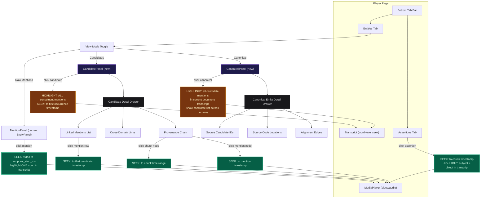

# Entity Stack Viewer — Frontend Update Plan

**Date:** 2026-04-09
**Status:** Design
**Scope:** `packages/media-ingest/viewer-ui/` (React/TS) + `packages/media-ingest/src/media_ingest/viewer/` (Python API)

---

## 1. Overview

The media viewer currently shows raw NER mentions grouped by type (PERSON, ORG, GPE, etc.) in the EntityPanel.
After the concordance update, the pipeline now produces three tiers of entity data:

| Layer   | Asset                      | Storage           | Data Shape                                        |
|---------|----------------------------|-------------------|---------------------------------------------------|
| Gold    | `media_mentions`           | S3 (JSONL)        | `Mention` — individual entity spans from text      |
| Gold    | `media_entity_candidates`  | S3 (JSONL)        | `EntityCandidate` — grouped mentions within media  |
| Platinum| `canonical_entities`       | PostgreSQL + Neo4j| `CanonicalEntity` — cross-source resolved entities |
| Platinum| `entity_alignments`        | PostgreSQL + Neo4j| `AlignmentEdge` — cross-source alignment links     |

The viewer must surface this full entity stack so users can drill from canonical entities down to the source text that produced them.

---

## 2. UI Flow: Entity Drill-Down with Click-Through Navigation

Every level of the entity hierarchy supports click-through to the relevant
temporal position in the video. This is the defining feature of the media
viewer -- what the Streamlit data-explorer cannot do.



---

## 3. New TypeScript Types

Add to `viewer-ui/src/types/media.ts`:

```typescript
/** Gold: grouped mentions resolved within the media_ingest code location */
export interface EntityCandidate {
  candidate_id: string;
  canonical_name: string;
  candidate_type: string;       // MentionType enum value
  aliases: string[];
  mention_ids: string[];
  mention_count: number;
  source_documents: string[];
  code_location: string;        // always "media_ingest" for this viewer
  embedding?: number[] | null;  // omitted in API response for payload size
  content_hash: string;
}

/** Platinum: cross-source resolved entity from the knowledge-graph service */
export interface CanonicalEntity {
  canonical_id: string;
  canonical_name: string;
  entity_type: string;
  aliases: string[];
  description: string;
  source_candidate_ids: string[];
  source_code_locations: string[];  // e.g. ["media_ingest", "congress_data", "open_leaks"]
  mention_count: number;
  first_seen: string;   // ISO datetime
  last_seen: string;    // ISO datetime
}

/** Platinum: cross-source alignment edge */
export interface AlignmentEdge {
  edge_id: string;
  source_entity_id: string;     // candidate_id from one source
  target_entity_id: string;     // candidate_id from another source
  alignment_type: "sameAs" | "possibleSameAs";
  score: number;
  evidence: string[];           // e.g. ["exact_name", "jaccard", "embedding"]
  method: string;
}

/** Provenance chain for an entity — assembled by the API */
export interface EntityProvenance {
  canonical_entity: CanonicalEntity | null;
  candidates: EntityCandidate[];
  mentions: Mention[];
  assertions: Assertion[];      // assertions where entity is subject or object
  alignment_edges: AlignmentEdge[];
  cross_domain_entities: CrossDomainLink[];
}

/** A link to an entity in another code location (congress, leaks) */
export interface CrossDomainLink {
  code_location: string;
  candidate_id: string;
  canonical_name: string;
  candidate_type: string;
  alignment_type: "sameAs" | "possibleSameAs";
  score: number;
}
```

---

## 4. New API Endpoints

### 4.1 Endpoints in `media_ingest/viewer/routes/api.py`

| Method | Path | Source | Description |
|--------|------|--------|-------------|
| GET | `/viewer/api/documents/{id}/entity-candidates` | S3 | Entity candidates for this document |
| GET | `/viewer/api/entity-candidates/{candidate_id}` | S3 | Single entity candidate by ID |
| GET | `/viewer/api/entity-candidates/{candidate_id}/provenance` | S3 + PG | Full provenance chain |
| GET | `/viewer/api/canonical-entities` | PostgreSQL | All canonical entities (paginated) |
| GET | `/viewer/api/canonical-entities/{canonical_id}` | PostgreSQL | Single canonical entity detail |
| GET | `/viewer/api/canonical-entities/{canonical_id}/candidates` | PostgreSQL | Source candidates for a canonical entity |
| GET | `/viewer/api/canonical-entities/{canonical_id}/alignments` | PostgreSQL | Alignment edges for a canonical entity |

### 4.2 Data source per endpoint

**S3 (MinIO)** — gold-layer partitioned data:
- `media_entity_candidates` is stored at `gold/default/media/media_entity_candidates/{partition_key}/data.jsonl`
- `media_mentions` is stored at `gold/default/media/media_mentions/{partition_key}/data.jsonl`
- `media_assertions` is stored at `gold/default/media/media_assertions/{partition_key}/data.jsonl`

**PostgreSQL** (`knowledge_graph` database) — platinum-layer cross-source data:
- `canonical_entities` table — canonical_id, canonical_name, entity_type, aliases, embedding, mention_count
- `alignment_edges` table — edge_id, source_entity_id, target_entity_id, alignment_type, score, evidence
- `assertions` table — assertion_id, subject_canonical_id, predicate, object_canonical_id, qualifiers

### 4.3 Implementation notes

The `S3DataService` needs new methods:

```python
# New S3 key prefix
ENTITY_CANDIDATES_PREFIX = f"{_GOLD_PREFIX}/media_entity_candidates"

class S3DataService:
    # ... existing methods ...

    def load_entity_candidates(self, document_id: str) -> list[dict]:
        """Load entity candidates for a document from the gold layer."""
        key = f"{ENTITY_CANDIDATES_PREFIX}/{document_id}/data.jsonl"
        return self._load_jsonl(key)

    def load_all_entity_candidates(self) -> list[dict]:
        """Load entity candidates across all partitions (for search)."""
        # List all partition keys under the prefix, then load each
        ...
```

A new `PGDataService` is needed for platinum-layer queries:

```python
class PGDataService:
    """Reads canonical entities and alignment edges from PostgreSQL."""

    def list_canonical_entities(self, limit=100, offset=0, entity_type=None) -> list[dict]:
        """Paginated list of canonical entities."""

    def get_canonical_entity(self, canonical_id: str) -> dict | None:
        """Single canonical entity by ID."""

    def get_candidates_for_canonical(self, canonical_id: str) -> list[dict]:
        """Get source candidate IDs linked to a canonical entity."""

    def get_alignment_edges(self, candidate_id: str) -> list[dict]:
        """Get alignment edges involving a candidate."""

    def get_assertions_for_entity(self, canonical_id: str) -> list[dict]:
        """Get assertions where entity is subject or object."""
```

---

## 5. New and Modified React Components

### 5.1 Modified: `EntityPanel.tsx` -> View mode toggle

**Current behavior:** Takes raw `Mention[]`, groups by type, shows count per unique text.

**New behavior:** Add a view-mode toggle at the top:

```
[ Mentions | Candidates | Canonical ]
```

- **Mentions mode** (default): Current behavior, unchanged.
- **Candidates mode**: Fetch entity candidates for this document, show grouped by type with canonical_name, alias count, mention_count. Clicking a candidate opens the detail drawer.
- **Canonical mode**: Fetch canonical entities for the entity candidates in this document (requires a backend join), show cross-source resolved entities.

The component props expand to:

```typescript
interface EntityPanelProps {
  documentId: string;
  mentions: Mention[];
  onEntityClick?: (text: string) => void;
  className?: string;
}
```

### 5.2 New: `CandidateList.tsx`

Displays a list of EntityCandidate objects, grouped by candidate_type:

```
PERSON (4 candidates, 23 mentions)
  [v] Jeffrey Epstein — 12 mentions, 3 aliases
      Aliases: Jeff Epstein, Epstein, J. Epstein
  [ ] Ghislaine Maxwell — 8 mentions, 2 aliases
  ...

ORG (2 candidates, 7 mentions)
  [v] JPMorgan Chase — 5 mentions, 1 alias
  ...
```

Props:
```typescript
interface CandidateListProps {
  candidates: EntityCandidate[];
  onSelect: (candidate: EntityCandidate) => void;
  selectedId?: string;
  className?: string;
}
```

### 5.3 New: `CandidateDetailDrawer.tsx`

Slide-out drawer or expandable panel showing full detail for a selected EntityCandidate:

**Sections:**
1. **Identity** — canonical_name, candidate_type, candidate_id
2. **Aliases** — pill/chip list of all aliases with individual mention counts
3. **Source Mentions** — expandable list of linked mentions with chunk context
4. **Cross-Domain Links** — if this candidate has alignment edges to congress/leaks candidates, show them with score badges
5. **Provenance Chain** — visual breadcrumb: Chunks -> Mentions -> EntityCandidate -> CanonicalEntity
6. **Assertions** — assertions where this entity appears as subject or object

Props:
```typescript
interface CandidateDetailDrawerProps {
  candidate: EntityCandidate;
  provenance: EntityProvenance | null;
  isLoading: boolean;
  onClose: () => void;
  onSeekToChunk?: (chunkId: string) => void;
  onHighlightText?: (text: string) => void;
}
```

### 5.4 New: `CanonicalEntityPanel.tsx`

For the "Canonical" view mode — shows cross-source resolved entities relevant to this document:

```
Jeffrey Epstein (PERSON)  — 45 mentions across 3 sources
  Sources: media_ingest, congress_data, open_leaks
  Aliases: Jeff Epstein, Epstein, J. Epstein, Jeffrey E. Epstein
  [View Full Profile] [View in Knowledge Graph]
```

Props:
```typescript
interface CanonicalEntityPanelProps {
  documentId: string;
  className?: string;
}
```

This component fetches canonical entities from the PG-backed API endpoint and cross-references against the document's entity candidates.

### 5.5 New: `ProvenanceChain.tsx`

Visual component showing the full lineage of an entity:

```
Source Chunk        Mention              EntityCandidate      CanonicalEntity
  chunk_abc123  ->  "Jeff Epstein"   ->  Jeffrey Epstein  ->  Jeffrey Epstein
  chunk_def456  ->  "Epstein"        ->        |                     |
  chunk_ghi789  ->  "J. Epstein"     ->        |                     |
                                                                     |
                                          [congress_data]            |
                                          Jeffrey Epstein  ----------+
                                          [open_leaks]               |
                                          J. Epstein      -----------+
```

Rendered as a horizontal DAG with clickable nodes. Clicking a chunk seeks the transcript to that segment. Clicking a mention highlights it.

### 5.6 New: `CrossDomainBadge.tsx`

Small badge component shown next to entity candidates that have cross-domain links:

```
Jeffrey Epstein  [CONGRESS] [LEAKS]
```

Each badge is colored by source and shows the alignment score on hover.

### 5.7 New: `AlignmentScoreBadge.tsx`

Shows the alignment type and score:
- sameAs (>=0.90): solid green badge
- possibleSameAs (0.65-0.89): amber outline badge

### 5.8 Modified: `Player.tsx`

Changes:
1. Add `entityCandidates` to the data fetched by `useDocumentData`
2. Pass `documentId` to `EntityPanel`
3. Add a third bottom tab option for "Canonical Entities" (or integrate into existing entity tab via view-mode toggle)

### 5.9 Modified: `useDocumentData.ts`

Add a new query for entity candidates:

```typescript
const entityCandidatesQuery = useQuery({
  queryKey: ["entity-candidates", id],
  queryFn: () => fetchEntityCandidates(id),
  enabled,
  staleTime: 60_000,
});
```

Return `entityCandidates: entityCandidatesQuery.data ?? []` in the hook output.

### 5.10 New: `useEntityProvenance.ts`

Hook that fetches the full provenance chain for a selected entity candidate:

```typescript
export function useEntityProvenance(candidateId: string | undefined) {
  return useQuery({
    queryKey: ["entity-provenance", candidateId],
    queryFn: () => fetchEntityProvenance(candidateId!),
    enabled: !!candidateId,
    staleTime: 120_000,
  });
}
```

---

## 6. API Client Additions

Add to `viewer-ui/src/api/client.ts`:

```typescript
export function fetchEntityCandidates(documentId: string): Promise<EntityCandidate[]> {
  return apiFetch<EntityCandidate[]>(
    `/documents/${encodeURIComponent(documentId)}/entity-candidates`
  );
}

export function fetchEntityProvenance(candidateId: string): Promise<EntityProvenance> {
  return apiFetch<EntityProvenance>(
    `/entity-candidates/${encodeURIComponent(candidateId)}/provenance`
  );
}

export function fetchCanonicalEntities(params?: {
  limit?: number;
  offset?: number;
  entity_type?: string;
}): Promise<CanonicalEntity[]> {
  const qs = new URLSearchParams();
  if (params?.limit) qs.set("limit", String(params.limit));
  if (params?.offset) qs.set("offset", String(params.offset));
  if (params?.entity_type) qs.set("entity_type", params.entity_type);
  return apiFetch<CanonicalEntity[]>(`/canonical-entities?${qs}`);
}

export function fetchCanonicalEntity(canonicalId: string): Promise<CanonicalEntity> {
  return apiFetch<CanonicalEntity>(
    `/canonical-entities/${encodeURIComponent(canonicalId)}`
  );
}

export function fetchAlignmentEdges(candidateId: string): Promise<AlignmentEdge[]> {
  return apiFetch<AlignmentEdge[]>(
    `/canonical-entities/${encodeURIComponent(candidateId)}/alignments`
  );
}
```

---

## 7. Data Flow: What Comes from S3 vs PostgreSQL

```
┌──────────────────────────────────────────────────────────────────────┐
│                          S3 (MinIO)                                  │
│                                                                      │
│  gold/default/media/media_mentions/{partition}/data.jsonl            │
│  gold/default/media/media_entity_candidates/{partition}/data.jsonl   │
│  gold/default/media/media_assertions/{partition}/data.jsonl          │
│                                                                      │
│  Used for: per-document mentions, entity candidates, assertions      │
│  Accessed via: S3DataService (existing + new methods)                │
└──────────────────────────────────────────────────────────────────────┘

┌──────────────────────────────────────────────────────────────────────┐
│                     PostgreSQL (knowledge_graph DB)                   │
│                                                                      │
│  canonical_entities table                                            │
│    - canonical_id, canonical_name, entity_type, aliases,             │
│      embedding (pgvector), mention_count, first_seen, last_seen      │
│                                                                      │
│  alignment_edges table                                               │
│    - edge_id, source_entity_id, target_entity_id,                    │
│      alignment_type, score, evidence, method                         │
│                                                                      │
│  assertions table                                                    │
│    - assertion_id, subject_canonical_id, predicate,                  │
│      predicate_canonical, object_canonical_id, qualifiers,           │
│      confidence, negated, hedged, source_document_id, chunk_id       │
│                                                                      │
│  Used for: canonical entities, cross-source links, assertion graph   │
│  Accessed via: PGDataService (new)                                   │
└──────────────────────────────────────────────────────────────────────┘
```

### Join strategy for the provenance endpoint

The `/entity-candidates/{candidate_id}/provenance` endpoint must:
1. Load the EntityCandidate from S3 (scan entity_candidates partitions or cache an index)
2. Load linked mentions from S3 (filter mentions by mention_ids from the candidate)
3. Query PostgreSQL for canonical entities where `candidate_id IN source_candidate_ids`
4. Query PostgreSQL for alignment edges where `source_entity_id = candidate_id OR target_entity_id = candidate_id`
5. Query PostgreSQL for assertions where `subject_canonical_id` or `object_canonical_id` matches
6. For each alignment edge, resolve the other candidate's canonical_name and code_location

This is the most expensive endpoint and should be cached aggressively (TTL 5-10 minutes).

---

## 8. File Inventory: What to Create / Modify

### New files

| File | Type | Description |
|------|------|-------------|
| `viewer-ui/src/components/CandidateList.tsx` | React | Entity candidate list grouped by type |
| `viewer-ui/src/components/CandidateDetailDrawer.tsx` | React | Detail panel for selected candidate |
| `viewer-ui/src/components/CanonicalEntityPanel.tsx` | React | Canonical entity view for a document |
| `viewer-ui/src/components/ProvenanceChain.tsx` | React | Visual DAG of entity lineage |
| `viewer-ui/src/components/CrossDomainBadge.tsx` | React | Badge for cross-source entity links |
| `viewer-ui/src/components/AlignmentScoreBadge.tsx` | React | Badge showing alignment type + score |
| `viewer-ui/src/hooks/useEntityProvenance.ts` | React hook | Fetches provenance for a candidate |
| `viewer/services/pg_data.py` | Python | PostgreSQL reader for canonical entities |

### Modified files

| File | Change |
|------|--------|
| `viewer-ui/src/types/media.ts` | Add EntityCandidate, CanonicalEntity, AlignmentEdge, EntityProvenance, CrossDomainLink types |
| `viewer-ui/src/api/client.ts` | Add fetchEntityCandidates, fetchEntityProvenance, fetchCanonicalEntities, fetchAlignmentEdges |
| `viewer-ui/src/hooks/useDocumentData.ts` | Add entityCandidatesQuery |
| `viewer-ui/src/components/EntityPanel.tsx` | Add view-mode toggle (Mentions / Candidates / Canonical) |
| `viewer-ui/src/pages/Player.tsx` | Pass documentId to EntityPanel, handle new data |
| `viewer/routes/api.py` | Add 7 new endpoints |
| `viewer/services/s3_data.py` | Add load_entity_candidates, ENTITY_CANDIDATES_PREFIX |

---

## 9. Phased Implementation Plan

### Phase A: Backend endpoints (Python)

1. Add `ENTITY_CANDIDATES_PREFIX` and `load_entity_candidates()` to `S3DataService`
2. Create `PGDataService` with methods for canonical entities, alignment edges, assertions
3. Add the 7 new API routes to `api.py`
4. Add the provenance assembly endpoint (join S3 + PG data)

### Phase B: Core frontend types and client

1. Add new TypeScript types to `media.ts`
2. Add new fetch functions to `client.ts`
3. Add `useEntityProvenance` hook
4. Update `useDocumentData` to include entity candidates

### Phase C: Candidate view

1. Build `CandidateList.tsx` — type-grouped candidate listing
2. Build `CandidateDetailDrawer.tsx` — detail panel with aliases, mentions, provenance
3. Add view-mode toggle to `EntityPanel.tsx`
4. Wire up in `Player.tsx`

### Phase D: Canonical view and cross-domain links

1. Build `CanonicalEntityPanel.tsx`
2. Build `CrossDomainBadge.tsx` and `AlignmentScoreBadge.tsx`
3. Build `ProvenanceChain.tsx`
4. Add canonical view mode to EntityPanel

### Phase E: Polish and integration

1. Click entity candidate -> highlight in transcript (reuse existing highlightText mechanism)
2. Click mention in provenance chain -> seek to transcript segment
3. Add loading and error states for all new data fetches
4. Cache optimization for provenance endpoint

---

## 10. Design Considerations

### Performance
- Entity candidates are per-partition in S3, so loading for a single document is fast
- Canonical entities come from PostgreSQL with indexed canonical_id
- The provenance endpoint joins S3 + PG; cache for 5-10 minutes
- Embeddings should be omitted from API responses (large float arrays)

### Data staleness
- S3 entity_candidates may not exist for all documents yet (only where materialized)
- Canonical entities only exist after the knowledge-graph pipeline runs
- Show graceful fallbacks: "Entity candidates not yet computed" / "Not yet resolved in platinum layer"

### Relationship to data-explorer (Streamlit)
- The Streamlit data-explorer already has Entity Candidates (page 11) and Entity Concordance (page 8) browsers
- The viewer version should be lighter-weight and document-centric, not a full data browser
- The viewer adds time-aligned media context that Streamlit cannot provide (seek to transcript)

### Cross-domain navigation
- When a media entity links to a congress or leaks entity via alignment edges, the viewer should show the connection but does not need to embed the full other-domain viewer
- Link out to the data-explorer Streamlit pages for deep cross-source exploration
