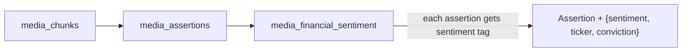
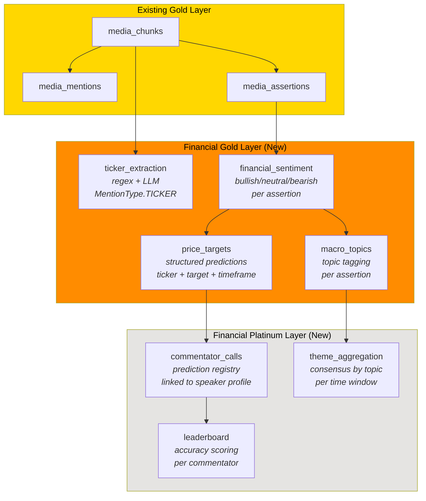
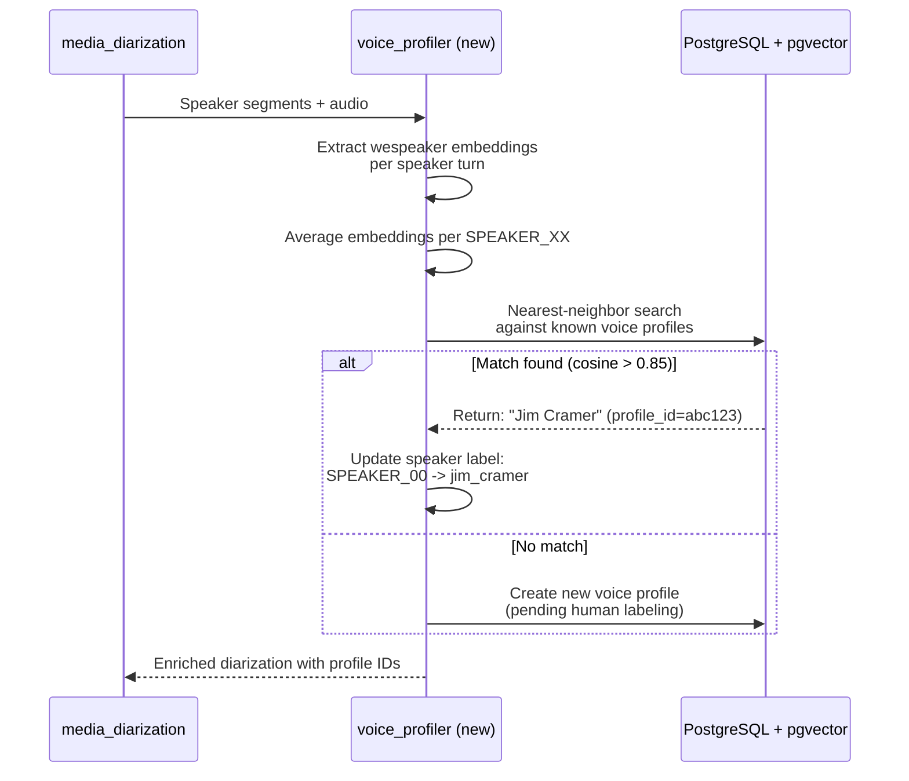
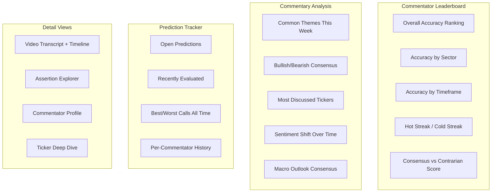
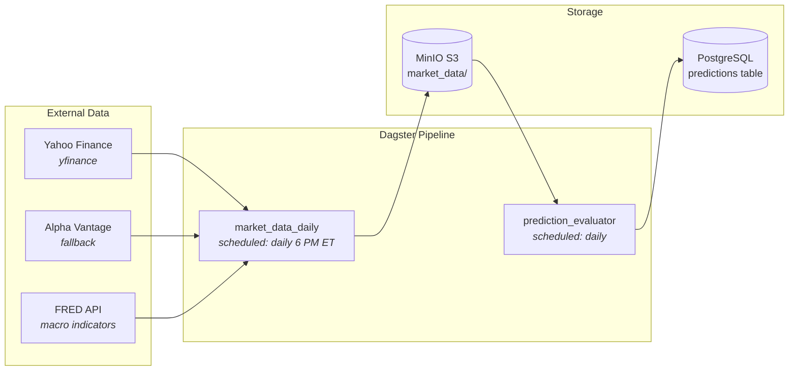
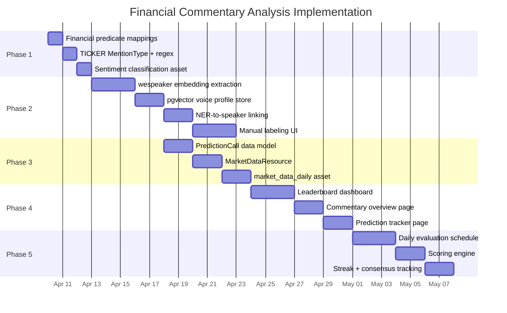

# Financial Commentary Analysis: Extending Media-Ingest for Trading YouTube Channels

**Status:** Investigation / Feature Request
**Date:** 2026-04-09
**Relates to:** media-ingest pipeline, CD-co0 (voice profiling)

---

## Table of Contents

1. [Origin](#1-origin)
2. [Current Capability Assessment](#2-current-capability-assessment)
3. [Financial Commentary Domain Model](#3-financial-commentary-domain-model)
4. [Speaker to Commentator Identity](#4-speaker-to-commentator-identity)
5. [Leaderboard / Accuracy Tracking](#5-leaderboard--accuracy-tracking)
6. [Data Sources and Integration](#6-data-sources-and-integration)
7. [Implementation Roadmap](#7-implementation-roadmap)
8. [Alignment Assessment](#8-alignment-assessment)

---

## 1. Origin

A friend posed the question:

> "Could you use this to pull in reputable trading channels, then create a dashboard showing common themes, bullish/neutral/bearish sentiment, common macroeconomic outlook, common stock picks, and a LEADERBOARD of which commentators are correct over time -- basically who is making profitable calls vs who is full of shit?"

The short answer is: the existing pipeline handles roughly 60-70% of this out of the box. The remaining 30-40% requires (a) domain-specific extraction prompts, (b) cross-video speaker identity (CD-co0), (c) market data integration for backtesting, and (d) a new Platinum-layer analysis pipeline.

---

## 2. Current Capability Assessment

### 2.1 What the Existing Pipeline Already Handles

The media-ingest pipeline is a 10-asset DAG running on the medallion architecture:

```
Bronze: media_files -> media_metadata
Silver: media_transcode -> media_documents -> media_chunks
Gold:   media_transcriptions -> media_diarization -> media_mentions / media_assertions / media_embeddings
```

Mapping the friend's requirements against current capability:

| Requirement | Current State | Gap |
|---|---|---|
| Ingest YouTube trading channels | MeTube/TubeSync already download YouTube videos. Just add channel subscriptions. | None -- operational, not engineering. |
| Transcribe commentary | OpenVINO whisper-large-v3 at 50x realtime on Intel GPU. Production-ready. | None. |
| Identify speakers within a video | pyannote speaker-diarization-3.1 produces SPEAKER_00, SPEAKER_01, etc. | Session-local only. No cross-video identity. |
| Identify speakers across videos | Not implemented. SPEAKER_00 in video A is not linked to SPEAKER_00 in video B. | **CD-co0** -- voice profiling via wespeaker embeddings + pgvector. |
| Extract entity mentions (people, orgs) | Gold-layer `media_mentions` with LLM NER. Extracts PERSON, ORG, GPE, MONEY, DATE, EVENT, etc. | Works today. Could add TICKER as a new MentionType. |
| Extract claims/assertions | Gold-layer `media_assertions` with qualified S-P-O triples. Has `hedged`, `negated`, `confidence`, `qualifiers`. | Works today. Needs financial predicate extensions. |
| Sentiment (bullish/neutral/bearish) | Not extracted. Assertions capture claims but do not classify market sentiment. | **New extraction step** or assertion post-processing. |
| Stock ticker extraction | MONEY entity type exists but captures dollar amounts, not ticker symbols. | **New MentionType: TICKER** + regex pattern matching. |
| Price target extraction | Not captured. "I think NVDA goes to $200" is extracted as an assertion but target/timeframe are not structured. | **New structured extraction schema.** |
| Macroeconomic themes | Assertions capture topic references, but no clustering or summarization. | **New Platinum-layer aggregation.** |
| Cross-source entity resolution | `ConcordanceEngine` (within code location) and `CrossSourceAligner` (across code locations) already exist in `dagster-io`. | Works today for named entities. Needs voice-profile signal for speaker resolution. |
| Prediction tracking | Not implemented. No concept of a "call" with a timestamp and evaluation criteria. | **New data model + market data integration.** |
| Leaderboard / accuracy scoring | Not implemented. | **New Platinum-layer pipeline + dashboard.** |

### 2.2 What Is Already Extractable from the Gold Layer

The existing `media_assertions` asset extracts S-P-O triples with this structure (from `Assertion` in `libs/dagster-io/src/dagster_io/models.py`):

```python
class Assertion(BaseModel):
    assertion_id: str
    subject_text: str          # "Jim Cramer"
    predicate: str             # "claims"
    predicate_canonical: str   # normalized via MEDIA_PREDICATE_MAPPINGS
    object_text: str           # "NVDA will hit $200 by Q4"
    qualifiers: dict           # {time, location, condition, manner, source_attribution}
    confidence: float          # 0-1
    negated: bool              # "does NOT think..."
    hedged: bool               # "may", "could", "reportedly"
    provenance: Provenance     # document_id, chunk_id, temporal_start_ms, speaker_label
```

The `MEDIA_PREDICATE_MAPPINGS` in `packages/media-ingest/src/media_ingest/assets/assertions.py` currently covers speech acts (states, claims, denies, confirms, supports, opposes, etc.) but has no financial-specific predicates.

The existing `media_mentions` asset extracts entities with types: PERSON, ORG, GPE, LOC, DATE, EVENT, MONEY, LAW, DOCUMENT, ROLE, OTHER (from `MentionType` enum in `libs/catalyst-contracts-core/src/catalyst_contracts_core/enums.py`).

**Key insight:** The assertion model already captures `hedged` and `negated` booleans plus `qualifiers.condition` -- these map naturally to conviction level. The `qualifiers.time` field can capture stated timeframes. The `qualifiers.source_attribution` links to diarized speakers. Most of the structural scaffolding is already in place.

### 2.3 Summary of Gaps

1. **No cross-video speaker identity** -- SPEAKER_00 is ephemeral per video
2. **No market sentiment classification** -- assertions lack bullish/neutral/bearish tagging
3. **No ticker/instrument extraction** -- MONEY captures dollar amounts, not $AAPL/$SPY
4. **No price target structuring** -- natural language targets exist in assertions but are not parsed into structured {ticker, direction, target_price, timeframe}
5. **No market data integration** -- cannot evaluate whether predictions came true
6. **No prediction tracking data model** -- no concept of a "call" lifecycle (predicted -> evaluated -> scored)
7. **No aggregation/dashboard layer** -- theme clustering, sentiment aggregation, and leaderboard ranking are all absent

---

## 3. Financial Commentary Domain Model

### 3.1 Sentiment Classification

Three implementation approaches, in order of recommendation:

**Option A (recommended): Post-assertion LLM classification step**

Add a new Gold-layer asset `media_financial_sentiment` that runs after `media_assertions`. This takes existing assertions and classifies each one for market sentiment. This is cleanest because it does not pollute the general-purpose assertion extraction.



The LLM prompt would be domain-specific:

```
Given this assertion from a financial commentary:
  Subject: {subject_text}
  Predicate: {predicate_canonical}
  Object: {object_text}
  Hedged: {hedged}
  Negated: {negated}

Classify:
- sentiment: BULLISH | NEUTRAL | BEARISH
- conviction: HIGH | MEDIUM | LOW (derived from hedged/negated + language)
- tickers: list of stock/ETF/index tickers mentioned (e.g., ["NVDA", "SPY"])
- asset_class: EQUITY | ETF | INDEX | COMMODITY | CRYPTO | BOND | MACRO
- timeframe: if stated, the expected timeframe (e.g., "Q4 2026", "next 6 months")
```

**Option B: Extended assertion extraction prompt**

Modify `ASSERTION_SYSTEM_PROMPT` in `assertions.py` to include financial sentiment fields. Downside: this couples financial domain logic into the general-purpose extraction pipeline used across all media.

**Option C: Segment-level sentiment scoring**

Run sentiment classification on raw text chunks rather than assertions. Simpler but loses the structural precision of knowing *what* claim is bullish/bearish.

**Recommendation:** Option A. The existing pipeline's `build_assertions()` factory in `asset_factories.py` already demonstrates the pattern of piping chunk results through structured output chains. A new `FinancialSentimentResult` schema would follow the same pattern:

```python
class FinancialSentiment(BaseModel):
    assertion_id: str
    sentiment: Literal["BULLISH", "NEUTRAL", "BEARISH"]
    conviction: Literal["HIGH", "MEDIUM", "LOW"]
    tickers: list[str]
    asset_class: str
    timeframe: str = ""
    is_prediction: bool  # True if this is a forward-looking call
    price_target: float | None = None
    price_direction: Literal["UP", "DOWN", "FLAT"] | None = None

class FinancialSentimentResult(BaseModel):
    sentiments: list[FinancialSentiment]
```

### 3.2 Stock/Ticker Extraction

Two complementary approaches:

**A. New MentionType: TICKER**

Extend the `MentionType` enum in `catalyst-contracts-core/enums.py`:

```python
class MentionType(str, Enum):
    PERSON = "PERSON"
    ORG = "ORG"
    # ...existing...
    TICKER = "TICKER"      # New: $AAPL, SPY, BTC-USD
    INSTRUMENT = "INSTRUMENT"  # New: "the S&P 500", "10-year treasury"
```

**B. Regex pre-extraction before LLM**

Financial tickers follow predictable patterns. A regex pass before (or alongside) LLM extraction would catch:
- Cashtag notation: `$AAPL`, `$SPY`, `$NVDA`
- Spoken references: "Apple stock", "the Nasdaq", "S&P 500"
- Crypto: "Bitcoin", "BTC", "Ethereum"

This could be implemented as a new `ExtractionMethod.REGEX` extraction pass, which the `Provenance` model already supports.

**C. Ticker normalization table**

A lookup mapping spoken names to canonical tickers:
- "Apple" -> AAPL
- "Nvidia" -> NVDA
- "the S&P" / "the S&P 500" / "S&P 500 index" -> SPX / SPY
- "ten-year" / "10-year treasury" / "TNX" -> TNX

This is similar to the existing `MEDIA_PREDICATE_MAPPINGS` pattern -- a flat dict of surface forms to canonical forms.

### 3.3 Price Target Extraction

When a commentator says "I think NVDA goes to $200 by end of Q4," the system needs to extract:

```python
class PriceTarget(BaseModel):
    ticker: str                    # "NVDA"
    direction: Literal["UP", "DOWN", "FLAT"]  # "UP"
    target_price: float | None     # 200.0
    current_price_ref: float | None  # if stated: "from $150..."
    timeframe_raw: str             # "by end of Q4"
    timeframe_parsed: str | None   # "2026-12-31" (ISO date, best effort)
    confidence: float              # from parent assertion
    hedged: bool                   # from parent assertion
    source_assertion_id: str       # links back to the Assertion
```

This should be extracted as a dedicated structured output step that runs on assertions classified as `is_prediction=True` by the sentiment classification step.

### 3.4 Macroeconomic Theme Extraction

For clustering commentary around macro themes (interest rates, inflation, recession, employment, tariffs, etc.), the recommended approach:

**Step 1: Topic tagging on assertions**

Add a topic classification step that tags each assertion with zero or more macro topics:

```python
class MacroTopic(str, Enum):
    INTEREST_RATES = "interest_rates"
    INFLATION = "inflation"
    RECESSION = "recession"
    EMPLOYMENT = "employment"
    GDP_GROWTH = "gdp_growth"
    TRADE_WAR = "trade_war"
    TARIFFS = "tariffs"
    FED_POLICY = "fed_policy"
    EARNINGS = "earnings"
    HOUSING = "housing"
    ENERGY = "energy"
    GEOPOLITICS = "geopolitics"
    REGULATION = "regulation"
    TECH_SECTOR = "tech_sector"
    AI_ML = "ai_ml"
```

**Step 2: Aggregation in Platinum layer**

Group assertions by macro topic across all videos in a time window. Compute:
- Consensus sentiment per topic (% bullish vs bearish across commentators)
- Trend over time (is the consensus shifting?)
- Which commentators are outliers vs consensus?

### 3.5 Complete Financial Extraction Pipeline



---

## 4. Speaker to Commentator Identity

### 4.1 The Problem

The current pipeline produces session-local speaker labels: `SPEAKER_00`, `SPEAKER_01`, etc. These are unique within a single video but meaningless across videos. If Jim Cramer appears in 50 different videos, he is `SPEAKER_00` in some, `SPEAKER_01` in others, and there is no linkage.

For the financial leaderboard, cross-video speaker identity is essential: every prediction must be attributed to a named individual whose track record persists.

### 4.2 How Voice Profiling (CD-co0) Solves This

The planned CD-co0 feature adds voice profile embeddings to the diarization pipeline:



**Key technical components:**

1. **wespeaker embeddings**: pyannote already uses wespeaker internally for speaker embedding. The `pyannote.audio` `Inference` API can extract per-speaker embedding vectors from audio segments.

2. **pgvector storage**: The cluster already runs PostgreSQL with pgvector. Voice profile embeddings (256-512 dimensions) can be stored and queried with approximate nearest-neighbor search.

3. **Profile lifecycle**:
   - First encounter: create an anonymous profile with embedding
   - NER matching: if `media_mentions` extracts a PERSON name in proximity to a speaker label (e.g., "Thanks for joining us, Jim"), auto-link the profile
   - Manual labeling: dashboard for human verification of profile assignments
   - Subsequent encounters: automatic matching via cosine similarity

4. **Integration point**: The `Provenance` model already has `speaker_label: str | None`. This field would be extended from session-local labels (`SPEAKER_00`) to persistent profile IDs (`voice_profile:jim_cramer:abc123`).

### 4.3 Linking NER to Voice Profiles

The existing `media_mentions` asset extracts PERSON entities from transcript text. When a speaker is introduced by name ("Please welcome Cathie Wood"), the system can:

1. Detect the PERSON mention in proximity to a speaker turn transition
2. Associate the PERSON mention with the active `SPEAKER_XX` label
3. Link the `SPEAKER_XX` label to a voice profile

This creates a three-way join: voice embedding + NER name + speaker label. The `ConcordanceEngine` (in `libs/dagster-io/src/dagster_io/concordance.py`) already performs multi-signal entity resolution (exact match, substring, Jaccard, embedding cosine). Adding voice profile similarity as a fifth signal would extend this naturally.

---

## 5. Leaderboard / Accuracy Tracking

### 5.1 Prediction Data Model

A "call" is a structured prediction extracted from commentary:

```python
class PredictionCall(BaseModel):
    call_id: str                    # deterministic hash
    commentator_id: str             # voice profile ID or entity candidate ID
    commentator_name: str           # resolved name ("Jim Cramer")
    source_assertion_id: str        # links to the originating Assertion
    source_document_id: str         # which video
    source_timestamp_ms: int        # when in the video

    # The prediction
    ticker: str                     # "NVDA"
    direction: Literal["UP", "DOWN", "FLAT"]
    sentiment: Literal["BULLISH", "NEUTRAL", "BEARISH"]
    conviction: Literal["HIGH", "MEDIUM", "LOW"]
    target_price: float | None      # 200.0, or None if directional only
    entry_price: float | None       # market price at time of prediction (from API)
    timeframe_raw: str              # "by end of Q4"
    timeframe_days: int | None      # 90 (parsed from raw)
    evaluation_date: str | None     # ISO date: when to evaluate this call

    # Lifecycle
    status: Literal["OPEN", "HIT", "MISSED", "EXPIRED", "INVALIDATED"]
    created_at: str                 # ISO timestamp
    evaluated_at: str | None        # when the call was scored
    actual_price: float | None      # market price at evaluation time
    score: float | None             # accuracy score (see 5.3)

    # Context
    macro_topics: list[str]         # ["ai_ml", "tech_sector"]
    hedged: bool                    # was this a hedged/uncertain prediction?
    asset_class: str                # EQUITY, ETF, etc.
```

### 5.2 Market Data Integration

To evaluate predictions, the system needs historical and real-time price data.

**Recommended APIs (in priority order):**

| Provider | Cost | Capabilities | Notes |
|---|---|---|---|
| Yahoo Finance (yfinance) | Free | Daily OHLCV, real-time quotes | Unofficial, no SLA, but sufficient for daily evaluation |
| Alpha Vantage | Free tier: 25 req/day | Intraday, daily, technical indicators | Good free tier, official API |
| Polygon.io | Free tier: 5 req/min | Real-time, historical, reference data | Best data quality |
| Tiingo | Free tier: 500 unique tickers/month | End-of-day, IEX real-time | Solid free option |
| FRED (Federal Reserve) | Free | Macro data (rates, CPI, GDP) | Essential for macro theme evaluation |

**Implementation**: A new Dagster resource `MarketDataResource` that wraps yfinance (primary) with Alpha Vantage (fallback). A scheduled job fetches daily closing prices for all tickers with open predictions.

```python
class MarketDataResource(ConfigurableResource):
    """Fetch market data for prediction evaluation."""

    def get_price(self, ticker: str, date: str) -> float | None:
        """Get closing price for a ticker on a given date."""
        ...

    def get_price_range(self, ticker: str, start: str, end: str) -> pd.DataFrame:
        """Get OHLCV data for a date range."""
        ...

    def get_current_price(self, ticker: str) -> float | None:
        """Get current/latest price."""
        ...
```

### 5.3 Scoring Methodology

Three tiers of scoring, from simple to sophisticated:

**Tier 1: Binary directional accuracy**

Did the price move in the predicted direction within the stated timeframe?

```
score = 1.0 if (direction == "UP" and actual_return > 0) or
               (direction == "DOWN" and actual_return < 0) or
               (direction == "FLAT" and abs(actual_return) < 0.02)
        else 0.0
```

**Tier 2: Distance-based scoring**

How close was the price target to the actual price?

```
if target_price is not None:
    error = abs(actual_price - target_price) / target_price
    score = max(0, 1.0 - error)  # 0% error = 1.0, 100% error = 0.0
else:
    # Directional only: score by magnitude of correct move
    score = min(abs(actual_return) * 10, 1.0) if direction_correct else 0.0
```

**Tier 3: Risk-adjusted scoring**

Weight by conviction level and hedge status:

```
raw_score = tier_2_score
conviction_weight = {"HIGH": 1.5, "MEDIUM": 1.0, "LOW": 0.5}[conviction]
hedge_penalty = 0.7 if hedged else 1.0
final_score = raw_score * conviction_weight * hedge_penalty
```

### 5.4 Evaluation Timing

When to evaluate a prediction:

| Scenario | Evaluation Trigger |
|---|---|
| Explicit timeframe stated ("by Q4 2026") | On the stated date |
| Vague timeframe ("soon", "near term") | After 30 days |
| No timeframe | After 90 days (default) |
| Price target hit early | Immediately, marked as HIT |
| Price moves >20% against within timeframe | Immediately, marked as MISSED |

A Dagster schedule (daily) would scan all OPEN predictions, fetch current prices, and trigger evaluation when criteria are met.

### 5.5 Dashboard Design



The existing Data Explorer (Streamlit, `packages/data-explorer/`) can be extended with new pages for each section above.

---

## 6. Data Sources and Integration

### 6.1 YouTube Channel Ingestion

MeTube and TubeSync already handle YouTube downloads. The operational workflow is:

1. Add channel URLs to TubeSync (auto-downloads new videos)
2. Or paste individual video URLs into MeTube
3. The `media_files` discovery asset scans NFS mounts and picks up new files
4. The sensor (`media_document_sensor`) registers new partitions and kicks off the pipeline

**Example channels (for reference, not endorsement):**

| Channel | Type | Typical Content |
|---|---|---|
| CNBC | Mainstream | Market commentary, interviews, earnings coverage |
| Bloomberg | Mainstream | Macro analysis, policy commentary |
| Meet Kevin | Independent | Stock picks, macro analysis, real estate |
| Cathie Wood / ARK Invest | Fund manager | Disruptive innovation, tech bulls |
| Graham Stephan | Independent | Personal finance, market commentary |
| Tasty Trade / tastylive | Options-focused | Options strategies, market mechanics |
| Peter Schiff | Macro bear | Gold, inflation, anti-Fed |
| Raoul Pal (Real Vision) | Macro | Global macro, crypto |
| Chamath Palihapitiya | Venture/tech | Tech investing, SPACs |
| Kitco News | Commodities | Gold, silver, mining, macro |

### 6.2 Market Data Architecture



### 6.3 Prompt Registry Integration

The codebase already has a prompt registry system (`libs/dagster-io/src/dagster_io/prompts.py`) that loads `.prompt` files with YAML frontmatter from a configurable directory (`PROMPT_REGISTRY_DIR`). The financial domain prompts should be registered there:

```
prompts/
  financial/
    sentiment.prompt       # Assertion -> bullish/neutral/bearish
    price_target.prompt    # Extract structured price targets
    macro_topics.prompt    # Tag assertions with macro topics
    ticker_extract.prompt  # Identify tickers in text
```

This keeps prompts versionable and separate from code, matching the existing pattern.

---

## 7. Implementation Roadmap

### Phase 1: Financial Domain Prompts (2-3 days)

**Goal:** Extract financial signal from existing pipeline output without any model/schema changes.

- Add financial-specific predicate mappings to a new `FINANCIAL_PREDICATE_MAPPINGS` dict:
  ```python
  FINANCIAL_PREDICATE_MAPPINGS = {
      **MEDIA_PREDICATE_MAPPINGS,
      # Financial speech acts
      "recommends": "recommends",
      "predicts": "predicts",
      "forecasts": "predicts",
      "projects": "predicts",
      "targets": "targets",
      "upgrades": "upgrades",
      "downgrades": "downgrades",
      "rates": "rates",
      "warns": "warns",
      "expects": "predicts",
      "sees": "predicts",       # "I see NVDA going to $200"
      "likes": "recommends",    # "I like NVDA here"
      "is buying": "buys",
      "bought": "buys",
      "sold": "sells",
      "is selling": "sells",
      "is short": "shorts",
      "is long": "longs",
  }
  ```
- Add `TICKER` and `INSTRUMENT` to `MentionType` enum
- Add regex-based ticker pre-extraction (pattern: `\$[A-Z]{1,5}` plus a top-500 ticker lookup)
- Write financial sentiment prompt (bullish/neutral/bearish classification for assertions)
- Register prompts in the prompt registry

**Touches:**
- `libs/catalyst-contracts-core/src/catalyst_contracts_core/enums.py` (add TICKER, INSTRUMENT)
- `packages/media-ingest/src/media_ingest/assets/assertions.py` (optional: financial variant)
- New: `packages/media-ingest/src/media_ingest/assets/financial_sentiment.py`
- New: `packages/media-ingest/src/media_ingest/assets/ticker_extraction.py`
- New: prompt files in prompt registry

### Phase 2: Voice Profiling for Commentator Identity (1-2 weeks)

**Goal:** Link SPEAKER_XX labels to persistent commentator identities across videos.

This is the CD-co0 work item, which is prerequisite for the leaderboard but independently valuable for all media-ingest use cases.

- Extract wespeaker embeddings from diarized audio segments
- Store voice profile embeddings in pgvector
- Build voice profile matching (cosine similarity > 0.85 threshold)
- Add NER-to-speaker linking (when a PERSON mention occurs near a speaker turn)
- Build manual labeling UI in the Data Explorer
- Extend `Provenance.speaker_label` to carry profile IDs

**Touches:**
- `packages/media-ingest/src/media_ingest/assets/diarization.py` (add embedding extraction)
- New: `packages/media-ingest/src/media_ingest/assets/voice_profiles.py`
- New: voice profile PostgreSQL schema + pgvector index
- `libs/catalyst-contracts-core/src/catalyst_contracts_core/types.py` (extend Provenance)
- `packages/data-explorer/` (labeling UI)

### Phase 3: Prediction Tracking Data Model + Market Data (1 week)

**Goal:** Structure predictions and connect to market data for evaluation.

- Define `PredictionCall` Pydantic model (see section 5.1)
- Build `prediction_calls` Dagster asset: financial_sentiment + price_targets -> structured calls
- Build `MarketDataResource` wrapping yfinance + Alpha Vantage
- Build `market_data_daily` scheduled asset to fetch closing prices
- Store predictions in PostgreSQL (for stateful lifecycle tracking)

**Touches:**
- New: `libs/dagster-io/src/dagster_io/financial_models.py`
- New: `packages/media-ingest/src/media_ingest/assets/prediction_calls.py`
- New: `packages/media-ingest/src/media_ingest/resources/market_data.py`
- New: PostgreSQL schema for predictions

### Phase 4: Dashboard / Leaderboard UI (1 week)

**Goal:** Visualize commentary analysis and commentator accuracy.

- Leaderboard page: ranking table, accuracy charts, per-commentator drill-down
- Commentary overview page: themes, sentiment consensus, most-discussed tickers
- Prediction tracker page: open predictions, recent evaluations, hit/miss history
- Extend existing video viewer with financial annotations (sentiment badges on timeline, ticker highlights)

**Touches:**
- `packages/data-explorer/` (new Streamlit pages)
- React media viewer (if extending the existing one)

### Phase 5: Time-Series Accuracy Evaluation (ongoing)

**Goal:** Automated daily evaluation of open predictions.

- Dagster schedule: daily job that scans OPEN predictions against market data
- Scoring engine: implements Tier 1/2/3 scoring (see section 5.3)
- Streak tracking: detect hot/cold streaks for the leaderboard
- Sector accuracy breakdown: per-commentator accuracy by sector/asset class
- Consensus tracking: identify when a commentator is contrarian vs consensus and whether that improves their accuracy

**Touches:**
- New: `packages/media-ingest/src/media_ingest/jobs/evaluate_predictions.py`
- New: `packages/media-ingest/src/media_ingest/schedules/daily_evaluation.py`

### Phase Summary



---

## 8. Alignment Assessment

### 8.1 Is the Initial Analysis Sound?

**Yes, substantially.** The friend's intuition maps well onto the existing architecture. Specific validations:

1. **"Pull in reputable trading channels"** -- Correct. MeTube/TubeSync handles this today. Zero engineering work, purely operational (add channel URLs).

2. **"Common themes, bullish/neutral/bearish sentiment"** -- Correct. The existing assertion extraction captures the raw material (claims, supports, opposes, hedged, negated). Adding a sentiment classification layer on top is a straightforward LLM post-processing step.

3. **"Common stock picks"** -- Correct. Requires a new TICKER MentionType and regex extraction, but the existing NER pipeline handles entity extraction. The main new work is ticker normalization (mapping spoken names to canonical tickers).

4. **"Leaderboard of who is correct"** -- Correct in concept, but this is the hardest part. It requires: (a) cross-video speaker identity (CD-co0), (b) structured prediction extraction, (c) market data integration, and (d) an evaluation engine with nuanced scoring.

5. **"Who is making profitable calls vs who is full of shit"** -- This is the right framing but has a subtlety: distinguishing between "bad at predicting" and "deliberately misleading" is beyond the scope of automated analysis. The leaderboard can surface accuracy metrics; editorial judgment about intent is left to the user.

### 8.2 What Is Realistic Short-Term vs Long-Term?

**Short-term (1-2 weeks, achievable now):**

- Financial predicate mappings and sentiment classification on existing assertions
- Ticker extraction (regex + LLM)
- Basic theme tagging on assertions
- Dashboard showing sentiment distribution and most-discussed tickers per video
- All of this works with SPEAKER_XX labels (no cross-video identity needed)

**Medium-term (3-6 weeks):**

- Voice profiling (CD-co0) for cross-video speaker identity
- Structured prediction extraction with price targets
- Market data integration
- Basic leaderboard with directional accuracy scoring

**Long-term (2-3 months):**

- Sophisticated multi-tier accuracy scoring
- Streak detection and trend analysis
- Consensus vs contrarian tracking
- Historical backtest across months of archived commentary
- Full-featured dashboard with commentator profiles

### 8.3 What Are the Hardest Unsolved Problems?

**1. Prediction ambiguity (Hard)**

Financial commentary is full of hedged, conditional, and vague predictions. "I think tech could do well if the Fed cuts" is technically a prediction but is extremely hard to evaluate. The system needs a clear taxonomy of what counts as a scoreable prediction vs general commentary. Expect a high false-positive rate on prediction extraction initially; human review will be needed to calibrate prompts.

**2. Timeframe parsing (Medium-Hard)**

"Soon", "in the near term", "over the next few months" -- these need to be mapped to concrete evaluation dates. There is no perfect answer. The system should err on the side of longer evaluation windows and expose the raw timeframe text for human review.

**3. Voice profile accuracy at scale (Medium-Hard)**

wespeaker embeddings work well for clean audio with distinct speakers. Financial YouTube commentary varies wildly in audio quality -- phone-ins, multi-guest panels, background music, cross-talk. Accuracy will be high for solo commentators and lower for noisy multi-speaker environments. The system needs a confidence threshold and a graceful fallback (UNKNOWN_COMMENTATOR) rather than false matches.

**4. Survivorship bias in evaluation (Medium)**

The system can only evaluate predictions about instruments that still exist. If someone predicts a company goes bankrupt and it does, the ticker delists and daily price data disappears. The market data layer needs to handle delisted tickers, corporate actions (splits, mergers), and ticker changes.

**5. Attribution in multi-host shows (Medium)**

When a host says "Jim, what do you think about NVDA?" and Jim responds "I love it, I think it goes to $200" -- the system needs to attribute the prediction to Jim (the guest), not the host. This requires careful integration of diarization (who is speaking) with NER (who is being addressed) and assertion extraction (who is making the claim). The existing `qualifiers.source_attribution` field in assertions is designed for exactly this, but LLM extraction accuracy on attribution is currently untested in this domain.

**6. Market data cost at scale (Low-Medium)**

Free APIs (yfinance, Alpha Vantage free tier) are sufficient for daily evaluation of a few hundred tickers. If the system scales to thousands of open predictions across hundreds of tickers with intraday evaluation, paid data sources (Polygon.io, Tiingo) will be needed. This is a scaling concern, not a technical one.

---

## Appendix: Relevant Source Files

| File | Role |
|---|---|
| `packages/media-ingest/src/media_ingest/assets/assertions.py` | Gold-layer assertion extraction + MEDIA_PREDICATE_MAPPINGS |
| `packages/media-ingest/src/media_ingest/assets/mentions.py` | Gold-layer NER mention extraction |
| `packages/media-ingest/src/media_ingest/assets/diarization.py` | Speaker diarization with pyannote |
| `packages/media-ingest/src/media_ingest/assets/transcription.py` | Whisper transcription (OpenVINO + faster-whisper) |
| `packages/media-ingest/src/media_ingest/assets/chunks.py` | Text chunking (800/150 for speech) |
| `packages/media-ingest/src/media_ingest/assets/embeddings.py` | Vector embeddings for chunks |
| `packages/media-ingest/src/media_ingest/config.py` | Pipeline configuration |
| `packages/media-ingest/src/media_ingest/partitions.py` | Dynamic partition definition |
| `libs/dagster-io/src/dagster_io/models.py` | Core domain models (Mention, Assertion, EntityCandidate, etc.) |
| `libs/dagster-io/src/dagster_io/extraction_schemas.py` | LLM structured output schemas |
| `libs/dagster-io/src/dagster_io/asset_factories.py` | build_mentions(), build_assertions(), make_ner_asset() |
| `libs/dagster-io/src/dagster_io/llm.py` | LLMResource, EmbeddingResource |
| `libs/dagster-io/src/dagster_io/concordance.py` | Entity resolution engine |
| `libs/dagster-io/src/dagster_io/prompts.py` | Prompt registry loader |
| `libs/catalyst-contracts-core/src/catalyst_contracts_core/enums.py` | MentionType, AlignmentType enums |
| `libs/catalyst-contracts-core/src/catalyst_contracts_core/types.py` | Provenance model |
| `docs/diagrams/media-ingest-architecture.md` | Pipeline architecture diagrams |
